# 1. Product introduction

**KS3029 Keyestudio 4WD Mecanum Robot for Pico**

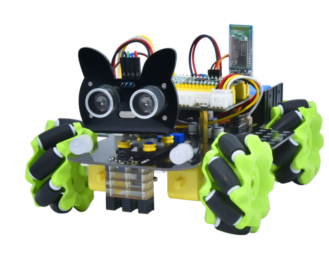

## 1.1 Description

Have you wondered to learn programming or have your own programming robot? Nowadays, programming has developed to a lower age group, and it will be a trend for everyone thanks to the spread of simple graphical programming platforms, from micro:bit to Arduino and Raspberry Pi.

Maybe you haven't heard of them before. However, with the help of this product and tutorial, you can easily install a multi-functional programming 4WD Mecanum car and experience the fun of being a maker.

Raspberry pi pico is a highly integrated microcontroller with powerful functions and small size. It is very suitable to be applied in STEAM education for its functions to make robots, wearable devices and electronic interactive games via the combination of code programming and graphical programming.

This Keyestudio 4WD Mecanum Robot Car For Pico is a smart DIY car dedicated to Raspberry Pi Pico. The smart car consists of a car body with extended functions, a PCB base plate with integrated motor driver sensors, 4 decelerating DC motors, Mecanum wheels, RGB lights, various sensors as well as acrylic boards. Therefore, you can easily assemble a cool Mecanum wheel 4WD smart car by yourself.

We made two tutorials for the car, one is for C language using Arduino IDE and the other is for MicroPython using Thonny IDE, which will guide you to enjoy installation and programming. 

In this process, not only can you enhance your ability to make stuffs but also learn the skills of programming.

Python is one of the most popular programming languages especially in machine learning for its availability and accessibility have brought huge convenience. However, MicroPython is committed to reviving the Python programming language in microcontrollers and embedded systems, while C language empowers us to get to the lower-level code.

This is a C language tutorial for 4WD Mecanum Robot Car For Pic and the code in this tutorial is written in C/C++. Each project code is explained in detail, making it more accessible for you to understand them. In closing if you have any difficulties or questions with this tutorial and toolkit, you can consult us at any time. 

## 1.2 Features

This product integrates a host of functions such as seven-color lights, WS2812RGB LEDs, servo, ultrasonic, line tracking, IR control as well as Bluetooth control. Among them, the seven-color lights, RGB2812 LEDs, motor drivers, 3-channel line tracking sensor, IR receivers (in order to receive accurately, we will place one at the head and one at the tail) are all integrated into the base plate, making it more accessible for us to install.

What’s more, the 4 WS2812RGB LEDs enable to display different colors, and the 2 seven-color lights empower to make direction lights for the car. By the way, the motor speed of this product is adjustable.

This product uses two 18650 lithium batteries for power supply. When installing and disassembling the battery, please pay attention to the positive and negative poles of the battery, and be sure not to reverse them. 

## 1.3 Parameters

- Connector port input: DC 6V---9V
- Operating voltage of driver board system: 5V
- Standard operating power consumption: about 3W
- Maximum power: 14W
- Motor speed: 200RPM
- Working temperature range: 0-50℃
- Dimension: 134*181*75mm
- Environmental protection attributes: ROHS

## 1.4 Kit List

| No.  | Components                                | QTY  | Picture                                |
| ---- | ----------------------------------------- | ---- | -------------------------------------- |
| 1    | Acrylic Board                             | 1    | 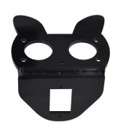                    |
| 2    | Acrylic Board with Lego Holes             | 1    |                     |
| 3    | Motor Plate                               | 4    | 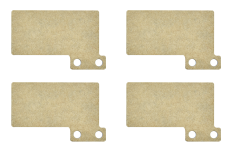 |
| 4    | Motor                                     | 4    | 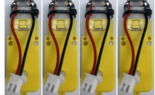 |
| 5    | Fixing Board                              | 4    |                     |
| 6    | Servo                                     | 1    | 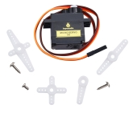                    |
| 7    | Bluetooth Module                          | 1    | 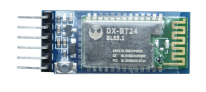                    |
| 8    | Mecanum Wheels (A direction)              | 2    | 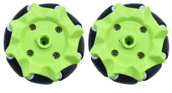 |
| 9    | Mecanum Wheels (B direction)              | 2    | 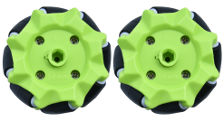 |
| 10   | Raspberry Pi Pico                         | 1    | 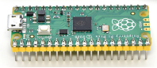                    |
| 11   | Keyestudio Sensor Shield                  | 1    | 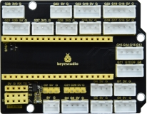                    |
| 12   | Keyestudio Mecanum Car Base Board         | 1    | 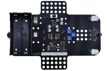                   |
| 13   | M3*20MM Dual-pass Copper Pillar           | 4    | 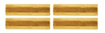                   |
| 14   | 4265c Lego Part                           | 4    | 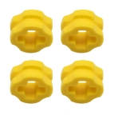                   |
| 15   | 43093 Lego Part                           | 4    | 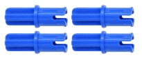                   |
| 16   | Acrylic Gasket                            | 1    | 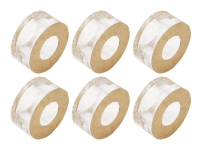                   |
| 17   | M3*6MM Flat Head Screw                    | 10   | 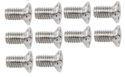                   |
| 18   | Ultrasonic Sensor                         | 1    | 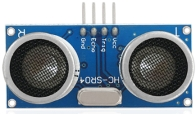                   |
| 19   | M3*8MM Flat Head Screw                    | 10   |                    |
| 20   | M3 Nickle-plated Nut                      | 10   | 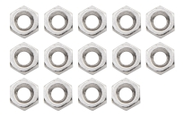                   |
| 21   | M3*30MM Round Head Screw                  | 9    | 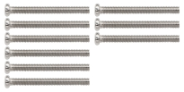                   |
| 22   | M2 Nickle-plated Nut                      | 3    | 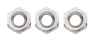  |
| 23   | M2*8MM Round Head Screw                   | 3    | 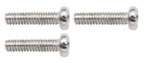                   |
| 24   | M1.4 Nickle-plated Nut                    | 6    |  |
| 25   | M1.4*10MM Round Head Screw                | 6    |  |
| 26   | M2.5*14MM Round Head Screw                | 4    | 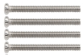                   |
| 27   | IR Remote Control                         | 1    |                    |
| 28   | Plastic String 3*100MM                    | 5    | 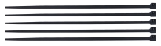                   |
| 29   | USB Cable                                 | 1    | 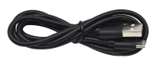                   |
| 30   | HX-2.54 2P DuPont Wire                    | 1    | 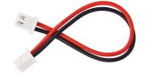                   |
| 31   | XH2.54 5P DuPont Wire                     | 1    | 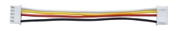                   |
| 32   | HX-2.54 4P DuPont Wire 160mm              | 1    | 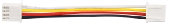                   |
| 33   | HX2.54mm-4P to 2.54 F-F DuPont Wire 150mm | 1    | 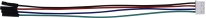                   |
| 34   | XH2.54 3P DuPont Wire 50mm                | 2    | 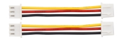                   |
| 35   | Screwdriver                               | 1    | 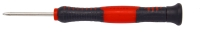                   |
| 36   | TT Coupling                               | 4    | 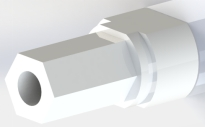                   |
| 37   | M1.2*5MM Round Head Self-tapping Screw    | 6    | 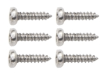                   |

## 1.5 Raspberry Pi Pico Introduction

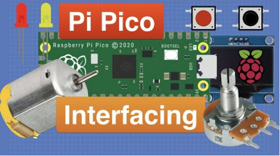

Pico is a board with powerful functions and low price as well as small size. Its dimension is similar to Arduino Nano, measuring 21mm x 51mm.

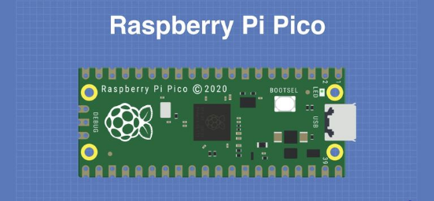

Raspberry Pi Pico is a low-cost, high-performance microcontroller with flexible digital interfaces. It owns the Raspberry Pi's RP2040 microcontroller chip, a 133mhz dual-core Arm Cortex M0 + processor, an embedded 264KB SRAM, a 2MB onboard flash memory as well as 26 multi-functional GPIO pins. 

For software development, you can use Raspberry Pi's C/C++SDK or MicroPython, and we use the latter in this tutorial. 

Bare board has no pins and needs to be welded. This is a well made circuit board and can also be welded directly to a printed circuit board as a SMD component. 

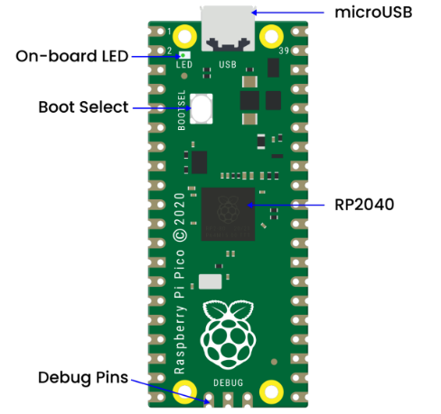

The main function of the board is the microUSB connector. It is used both for communication and to power the Pico.

An onboard LED is installed next to the microUSB connector, which is internally connected to GPIO pin 25 and it is the only LED on the entire Pico board. 

The start button is mounted slightly below the LED, which empowers to change the Pico's startup mode so that we can seek to load MicroPython on it for drag-and-drop programming.  

At the bottom of the board, we will see three connection points for the serial Debug option.

In the middle of the board is the "brain" of the entire board -- the RP2040 MCU, which enable to support 16MB of off-chip flash memory but it's only 4MB in Pico.

- Dual-core 32-bit ARM Cortex-M0 + processor
- Running at 48MHz but can be overclocked to 133MHz
- 30GPIO pins(26 exposed)
- Support USB host or device mode 
- 8 Programmable I/O (PIO) state machine

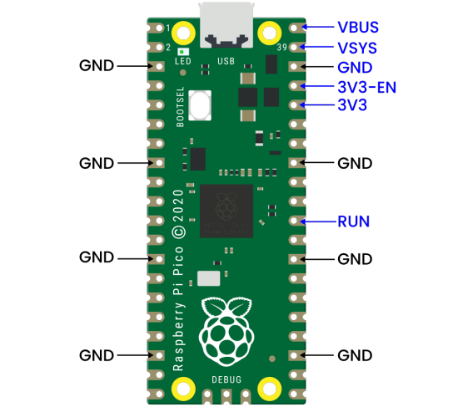

The Pico is a 3.3V logic device, which can be powered from a  series of power supplies thanks to a built-in voltage converter and voltage regulator. 

- GND -- Ground wire

- VBUS–––This is the power supply for the microUSB bus 5 V. If the Pico is not powered by the microUSB connector, there will be no output.
- VSYS–––This is the input voltage, which ranges from 2 to 5 V. The onboard voltage converter will change it to 3.3V for Pico.
- 3V3–––This is the 3.3 volt output of the Pico internal regulator. It can be used to power other components as long as the load is kept below 300ma. 

- 3V3_EN–––You can use this input to disable the Pico's internal voltage regulator, thus shutting down the Pico and any components powered by it. 
- RUN–––You can enable or disable the RP2040 microcontroller or reset it. 

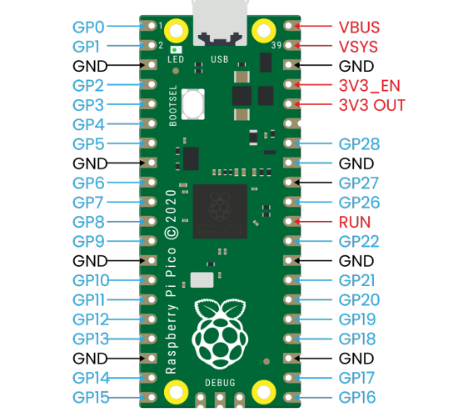

There are 26 bare GPIO connections on the Raspberry PI Pico board, which are arranged in a good order with "gaps" between GP22 and GP26 (these "missing" pins are used internally). These pins have multiple functions and you can configure up to 16 pins for the PWM. 

Furthermore, there are two I2C buses, two UART buses and two SPI buses, which can be configured using a variety of GPIO pins. 

Pico contains three analog-to-digital converters, which are ADC0-GP26, ADC1-GP27, ADC2-GP28. It also includes an internal converter ADC-VREF for onboard temperature sensor. 

Note: The ADC has a resolution of 12 bits. But MicroPython maps the range to 16 bits, from 0 to 65535, and the microprocessor's operating voltage is 3.3V, meaning that 0 corresponds to 0V and 65535 to 3.3V. 

You can also provide an external precision voltage reference on the ADC_VREF pins and the ADC_GND on pin 33 is used as the ground point for this reference point. 

| Raspberry Pi PICO Configuration                              |
| ------------------------------------------------------------ |
| Dual-core Arm Cortex-M0 + @ 133MHz                           |
| 2 × UART、2 × SPI controller and 2 × I2C controller          |
| Built-in 264KB SRAM and 2MB on-board flash memory            |
| 16 PWM Channels                                              |
| Up to 16MB of off-chip flash is supported via a dedicated QSPI bus |
| USB 1.1 Host and device support                              |
| DMA Controller                                               |
| 8×Programmable I/O (PIO) state machine for custom peripheral support |
| 30 GPIO pins, and four of them can be used as analog inputs  |
| Support USB mass storage startup mode of UF2 for drag-and-drop programming |

Pin Out:

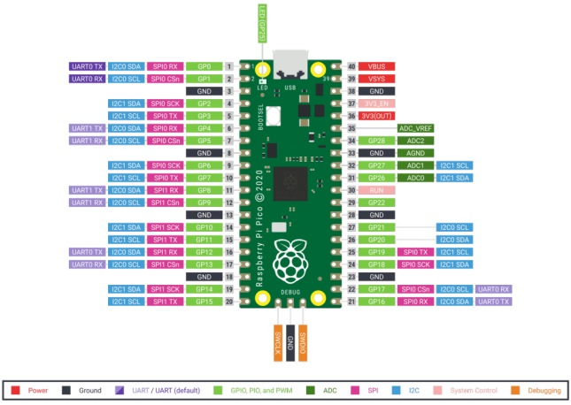

## 1.6 keyestudio Sensor Shield V2 for Raspberry Pico

**1.Description**

keyestudio Sensor Shield V2 for Raspberry Pico is an expansion board dedicated to developing Raspberry Pi Pico, which doesn’t  need to weld and the pins are fully led out. For easy connection, 2.54 anti-reverse plug terminals are used, and the ports on the expansion board are silkscreened. 

The silkscreen of the 3pin port is generally G V S, and G on the expansion board represents GND, V implies VCC (3.3V/5V, note that 3.3V cannot be connected to 5V power supply), and S indicates the digital/analog port above the port. Each 4pin/5pin interface has its corresponding interface silkscreen on the left. 

The board has a busbar interface with a spacing of 2.54mm (mainly used to make it convenient for servo wirings), which also contains a power indicator PWR and four location holes. 

The expansion board provides a host of communication interfaces including I2C, UART, 3 x analog IO and 13 x digital IO as well as a 5V power interface to make it more accessible for the prototype development.

**2.Specifications**

- Output current：≦200mA
- DC input voltage：5V
- Output voltage： DC 3.3V\5V
- Recommended ambient temperature：-10°C ~ 50°C
- Dimension：70 * 55 * 15mm
- Spacing of the pins：2.54mm

**3.Schematic Diagram**

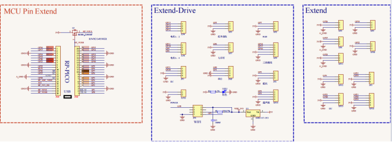

**4.Interface**

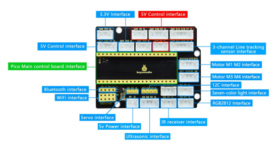

**5.Using Method**

Stack the Raspberry Pi Pico on the expansion board, as shown below:

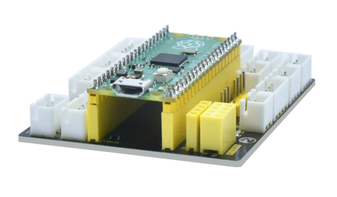

## 1.7 Keyestudio Mecanum Car Base Board(include motor driver)

**1.Description**

The motor driver base board contains a STC8 chip and a DRV8833 chip, etc. In order to save IO ports , we will use part of the pins of the STC8 chip to control the DRV8833 chip, and the HR8833 chip is used to control the rotation direction and speed of four DC deceleration motors. 

The STC8 is equivalent to the IIC slave device with an 8-channel PWM output (register 0x1~8) and 2-channel digital signal output (register 0x9~A). When we enter the corresponding values to the corresponding register, the chip will output the corresponding signals from the corresponding pins. 

The board is also equipped with a 3-channel line tracking sensor, IR receivers, four WS2812 lights, two seven-color lights, four dc deceleration motors.（two seven-color lights have been linked to the pins of the STC8 chip, four motors driven by DRV8833 chips have also been linked to the STC8, the rest of the sensors are controlled by the pins of the control board).

The dc deceleration motor is gear deceleration motor, which is based on the ordinary DC motors, and plus the gear reduction box. The box empowers to provide a lower speed and a stronger torque. 

At the same time, the gearbox of different reduction ratio can provide different speed and torque, making the dc motors used more frequently in the automation industry. What’s more, the dc deceleration motors are widely used in iron and steel industry as well as machinery industry, etc.

**2.Specifications**

- Connector port input: DC 6V---9V 
- Operating voltage of driver board system: 5V 
- Standard operating power consumption: about 2.2W 
- Maximum power: 12W 
- Motor speed: 200RPM
- Working temperature range: 0-50℃ 
- Dimension: 120*120*120mm 
- Environmental protection attributes: ROHS

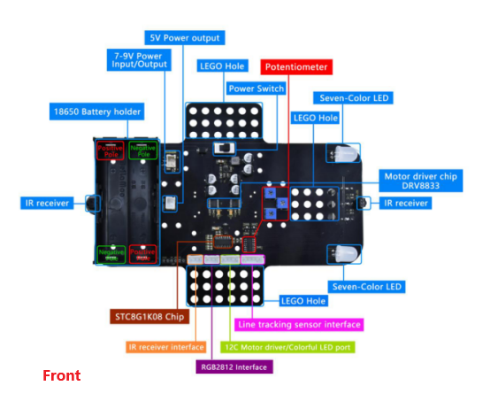

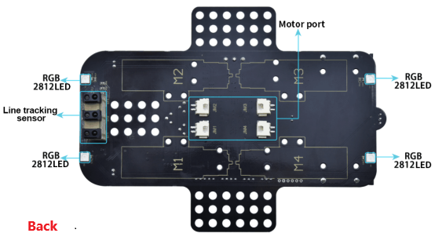

**3.Driver Board Circuit Diagram**

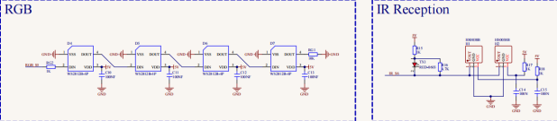

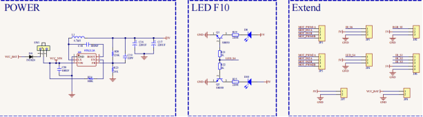