# 2. Product installation

**Part 1**

Components Needed

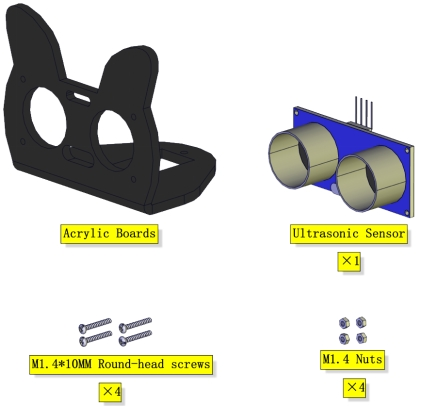

Installation Diagram

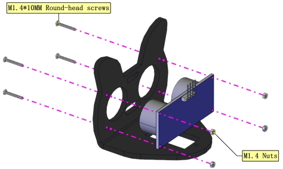

Prototype

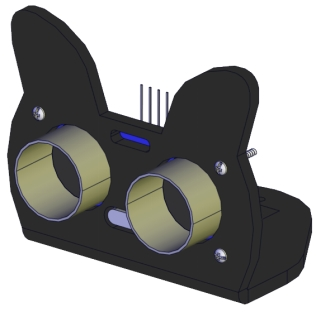

**Part 2**

Components Needed

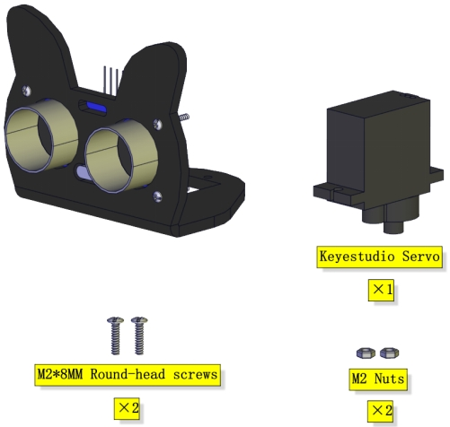

Installation Diagram

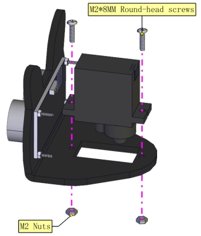

Prototype

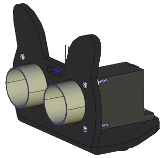

**Part 3**

Components Needed

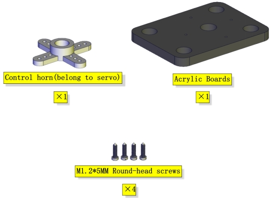

Installation Diagram

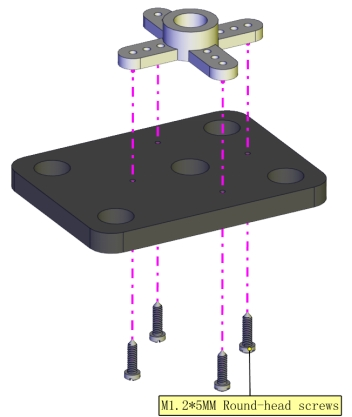

Prototype

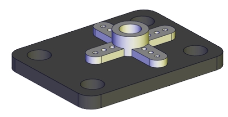

**Part 4**（adjust the angle of the servo first）

Adjust the angle of the servo to 90 degrees according to the test code

```
#include "Servo.h"
Servo myservo;

void setup() 
{
  myservo.attach(2);// attaches the servo on GIO2 to the servo object
  myservo.write(90);
  delay(500);
}

void loop() 
{
}
```

Components Needed

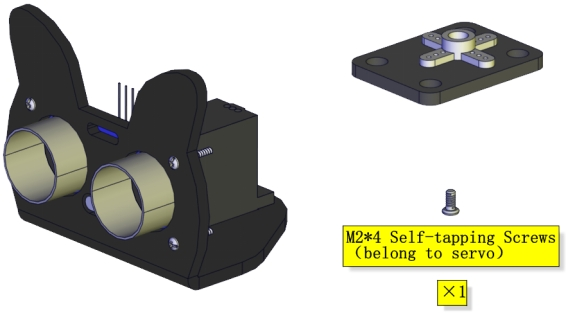

Installation Diagram(mind the installation direction)

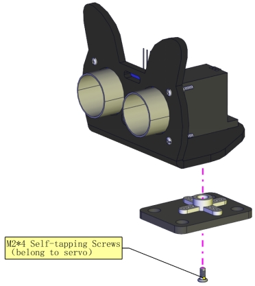

Prototype

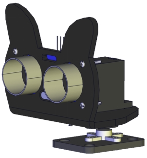

**Part 5**

Components Needed

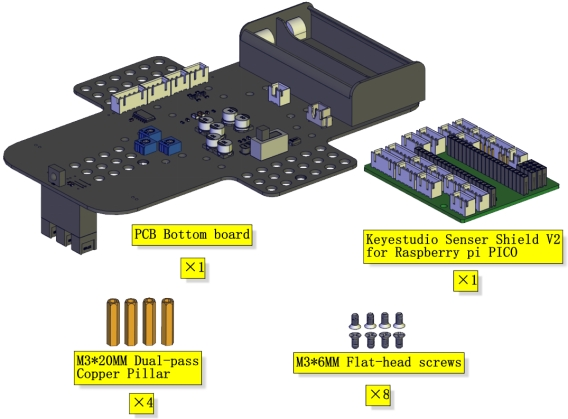

Installation Diagram

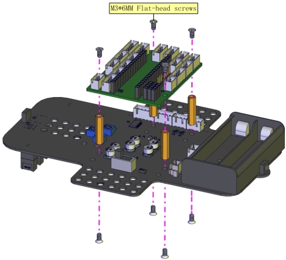

Prototype


**Part 6**

Components Needed

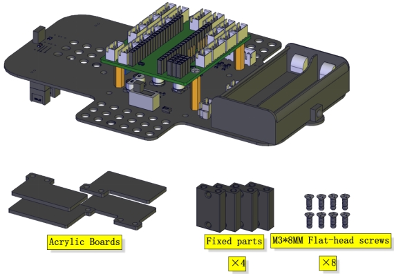

Installation Diagram

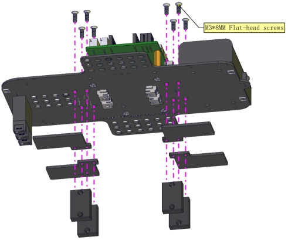

Prototype

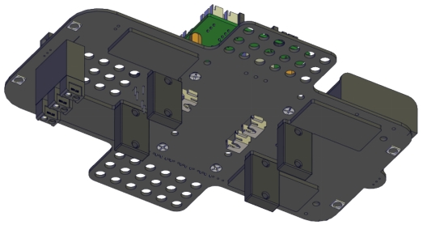

**Part 7**

Components Needed

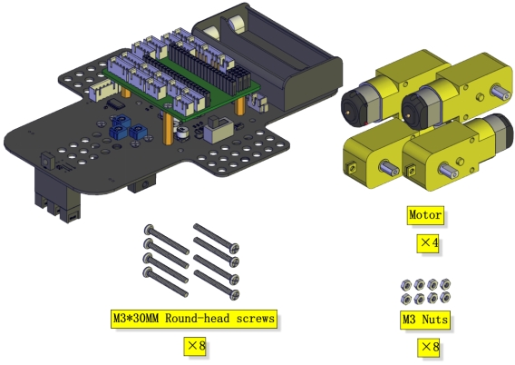

Installation Diagram(mind the direction of the motor)


Prototype

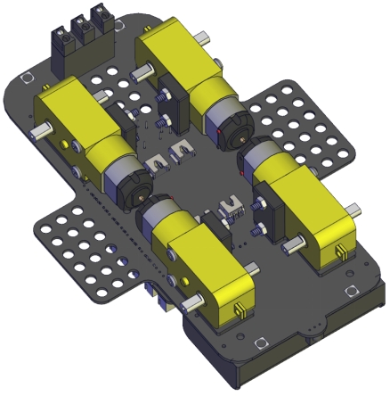

**Part 8**

Components Needed

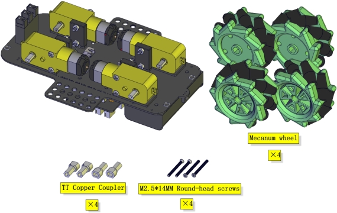

Installation Diagram

(Pay attention to the  installation direction of the mecanum wheel)

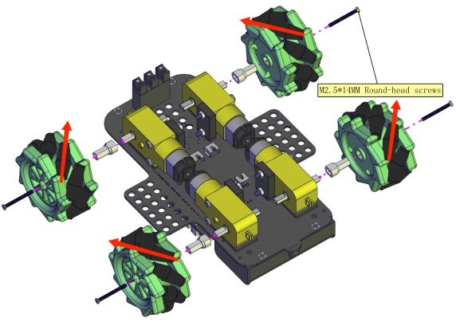

Prototype

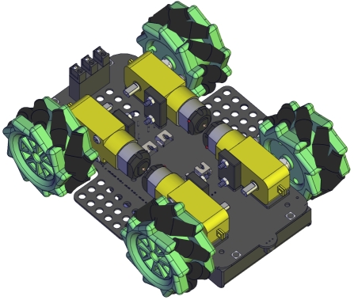

**Part 9**

Components Needed

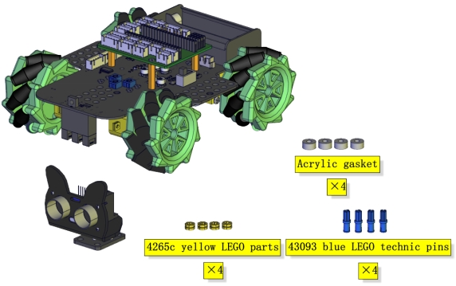

Installation Diagram

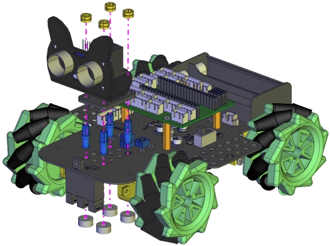

Prototype

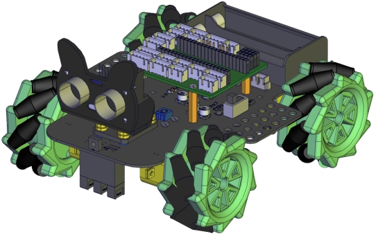

**Part 10**

Components Needed

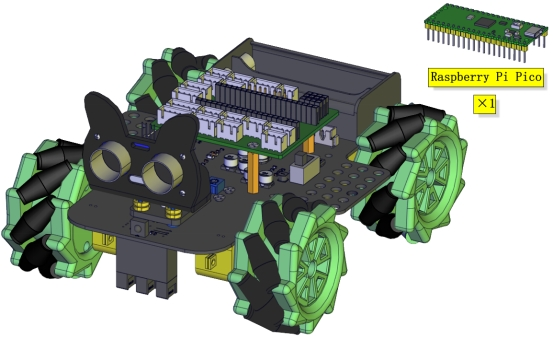

Installation Diagram

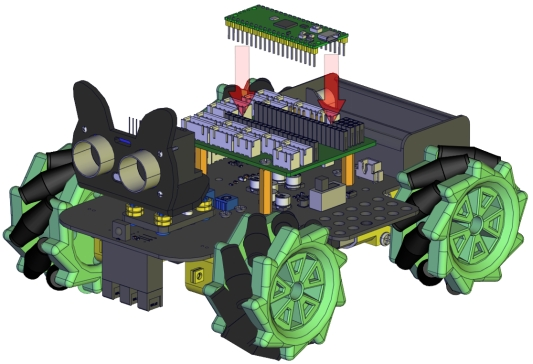

Prototype

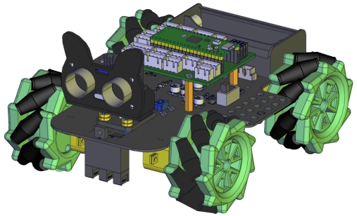

**Part 11**

Components Needed

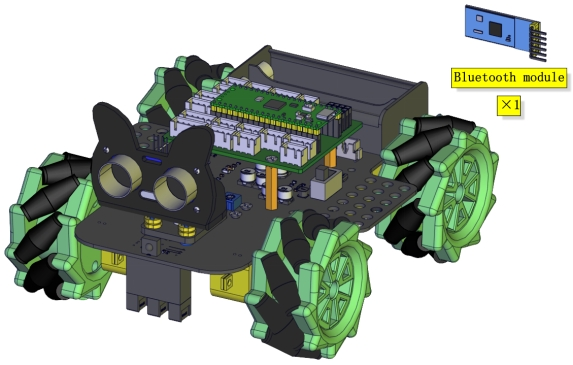

Installation Diagram

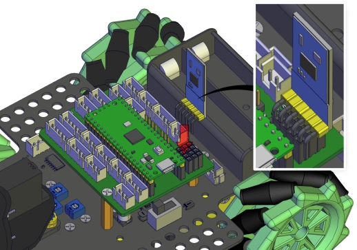

Prototype

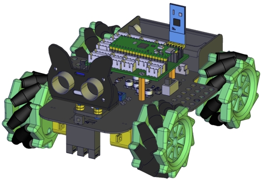

**Wiring Diagram**

The wiring of the servo

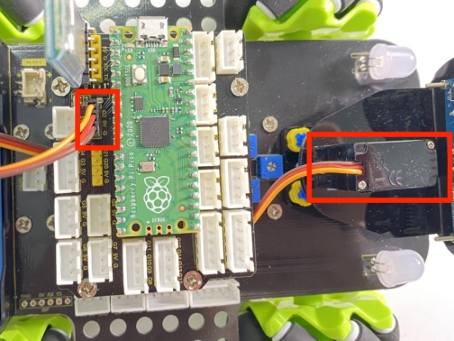

| Servo  | Expansion Board |
| ------ | --------------- |
| Brown  | G               |
| Red    | 5V              |
| Yellow | G2              |

The wiring of the ultrasonic sensor

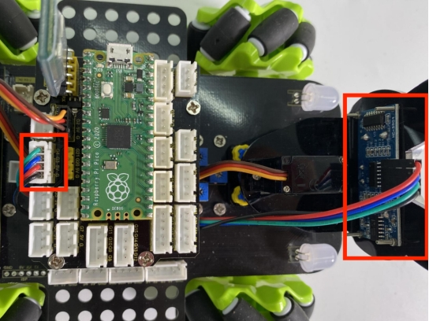

| Ultrasonic Sensor | Expansion Board |
| ----------------- | --------------- |
| VCC               | 5V              |
| TRIG              | G3              |
| ECHO              | G4              |
| GND               | G               |

The wiring of the IR receiver module

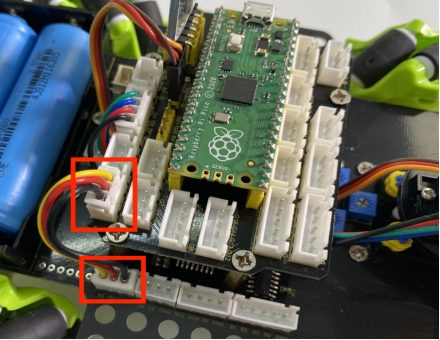

| Driver Board | Expansion Board |
| ------------ | --------------- |
| GND          | G               |
| 5V           | 5V              |
| S5           | G6              |

The wiring of the RGB

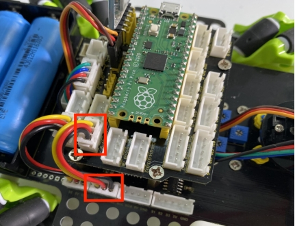

| Driver Board | Expansion Board |
| ------------ | --------------- |
| GND          | G               |
| 5V           | 5V              |
| S4           | G7              |

The wiring of controlling the motor and seven-color light

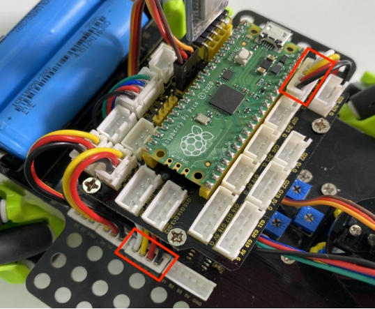

| Driver Board | Expansion Board |
| ------------ | --------------- |
| SCL          | G21             |
| SDA          | G20             |
| 5V           | 5V              |
| GND          | G               |

The wiring of controlling the 3-channel line-tracking sensor

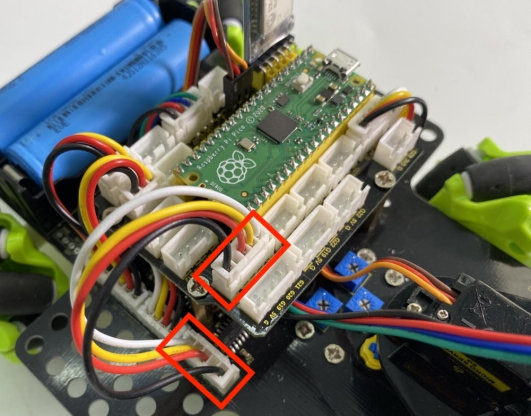

| Driver Board | Expansion Board |
| ------------ | --------------- |
| S1           | G18             |
| S2           | G17             |
| S3           | G16             |
| GND          | G               |

The wiring of the power supply

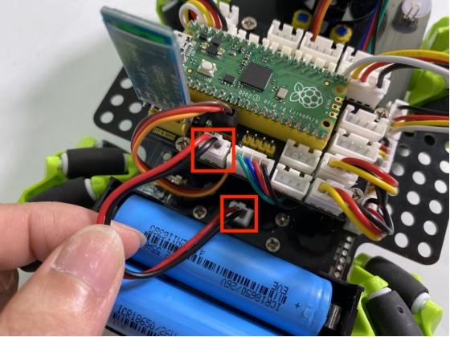

The corresponding interface of the motor

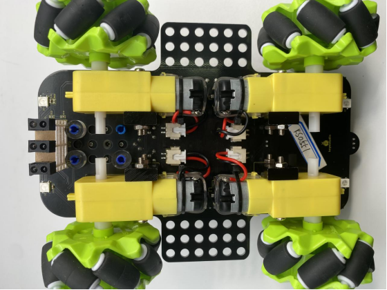

The installation of the battery

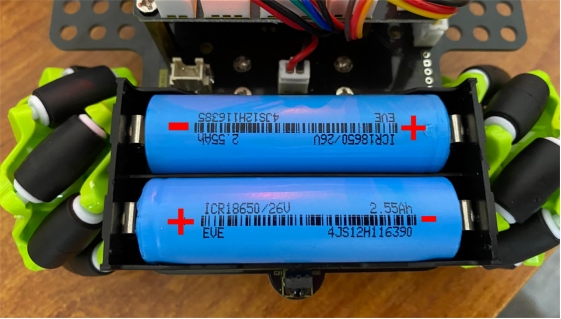