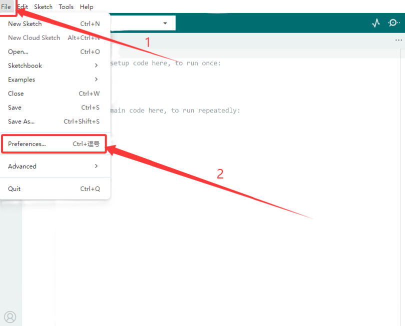
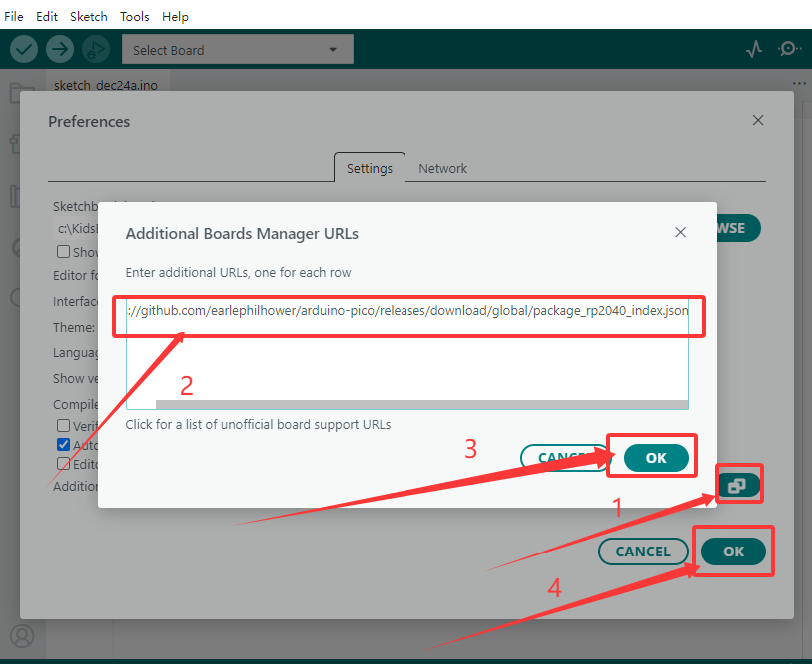
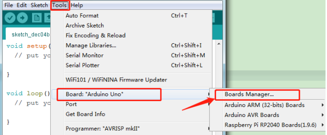
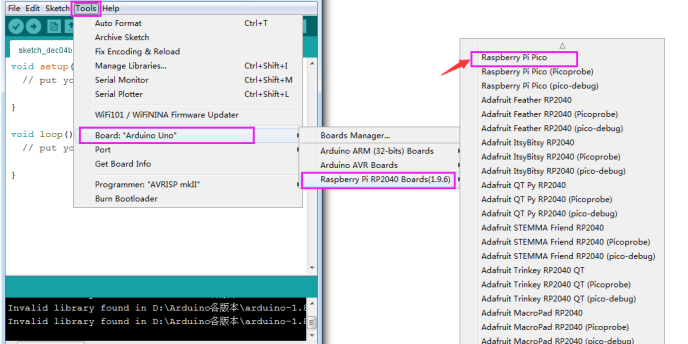
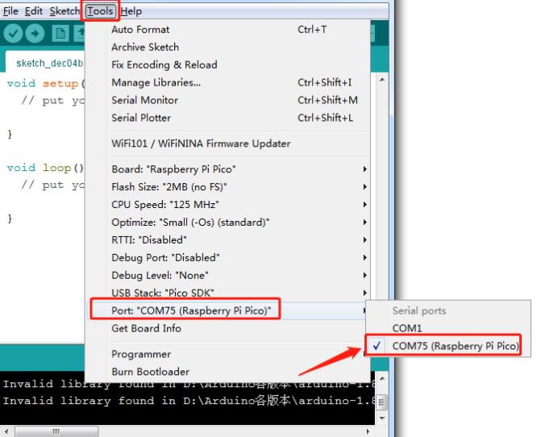
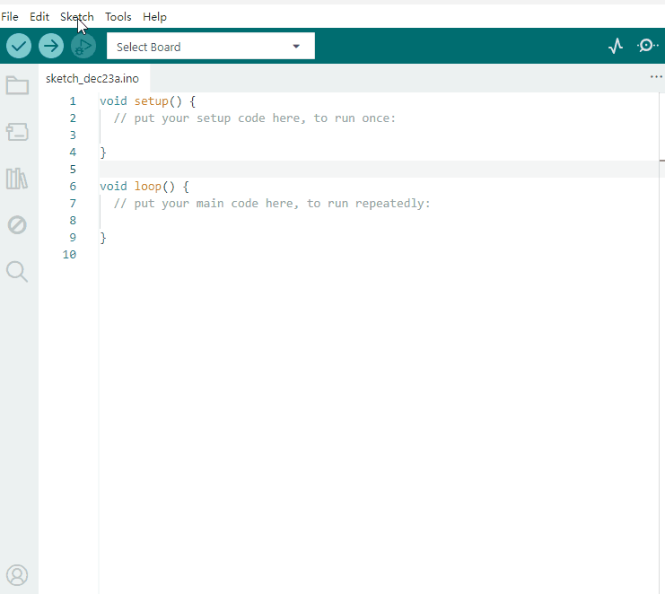

# 3. Arduino Tutorial

## 3.1 Data download

Arduino information contains library files and project code ,please click to download for follow-up study.

Data download:  [Arduino](./Arduino.7z)

## 3.2 Software Download

Open the browser and search:  https://www.arduino.cc/en/software, we will take WINDOWS system as an example to show you how to download and install.

You just need to click JUSTDOWNLOAD,then click the downloaded file to install it.And when the ZIP file is downloaded,you can directly unzip and start it.

## 3.3 Set Arduino IDE 

Set the pico environment (information：https://github.com/earlephilhower/arduino-pico)

Enter the URL in the「Additional Boards Manager URLs」https://github.com/earlephilhower/arduino-pico/releases/download/global/package_rp2040_index.json.

Click OK,Select (Tools)→ (Board) → (Board Manager)

Enter pico in the search area, the following screen will appear, and then click Install.

The IDE is already installed.

Then select(Tools)→ (Board) → Raspberry Pi RP2040 Boards(1.9.6) → Raspberry Pi Pico.

After selecting the development board, select the Port to connect to Pico.

## 3.4 Add Library

Open the Arduino IDE, follow [Sketch] → [Include Library] → [Add .zip Library]. This method can only import one library file at a time. If the product has multiple libraries, please import them one by one following this process!

## 3.5 Project