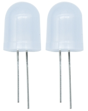
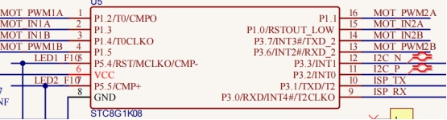

### Project 1 Seven-Color LED

**1.Description**



First we're going to finish the classic Arduino lit LED. Here we will use seven-color LEDs, which are components with a white appearance and display seven colors. 

Furthermore, the module can automatically flash the built-in colors, which can be used to make charming lighting effects. It is the same as the normal LED driver, which will automatically flash seven colors when we input high level and stop flashing when at low level.

We have integrated the seven-color LEDs into our motor driver board. In the first project, we will use a basic test code to control it to blink for 3 seconds, off for 1 second to achieve the control effect.

You can also change the time of the LEDs on and off in your code to achieve different duration effects. When in control, the LEDs will be on if S end is high level; otherwise, it will go off. 

**2.Component Knowledge**




The two seven-color LEDs are controlled by triode respectively, and the signal end is respectively connected to P5.4 and P5.5, thereby we solely need to control the two pins to output high and low levels to control the  LEDs.

**3.Test Code**

```c
#include "MecanumCar_v2.h"
mecanumCar mecanumCar(20, 21);  //sda-->20,scl-->21

void setup() 
{
  mecanumCar.Init();//Configure seven-color LED pin mode for output
}

void loop() 
{
  mecanumCar.right_led(1);//Turn on the right seven-color LED 
  mecanumCar.left_led(1); //Turn on the left seven-color LED 
  delay(3000);            //Delay in 3000 ms
  mecanumCar.right_led(0); //Turn off the right seven-color LED
  mecanumCar.left_led(0);  //Turn off the left seven-color LED
  delay(1000);             //Delay in 1000 ms
}
```

**4.Test Result** 

First, make sure the library files are installed, otherwise the code will fail to compile. Here we use the library file MecanumCar_v2, please refer to the develop environment for installation. After compiling and uploading the code, turn on the switch and power on, and we can see that the two seven-color LEDs on the base board blink for 3s and then go off for1s, then repeat this all the time.

**5.Code Explanation** 

| #include “MecanumCar_v2.h”                           | Import the MecanumCar_v2  file                               |
| ---------------------------------------------------- | ------------------------------------------------------------ |
| void setup()                                         | Initialize the setup code, which runs only once              |
| mecanumCar mecanumCar(sda, scl);                     | Create a car drive example to drive the motors and seven-color LEDs of the car, SDA is connected to GPIO20, SCL is connected to GPIO21, and the wirings can be changed. |
| void loop()                                          | This is a main loop, which is equivalent to while(1).        |
| mecanumCar.Init();                                   | Initialize the car drive.                                    |
| mecanumCar.right_led(1);<br>mecanumCar.right_led(0); | When the parameter is 1, output high level to the signal pin of the right seven-color LED, it will be on; When is 0, output low level to the signal pin, it will be off. |
| mecanumCar.left_led(1);<br>mecanumCar.left_led(0);   | When the parameter is 1, output high level to the signal pin of the left seven-color LED, it will be on; When is 0, output low level to the signal pin, it will be off. |
| delay(1000);                                         | Delay in 1000ms                                              |

