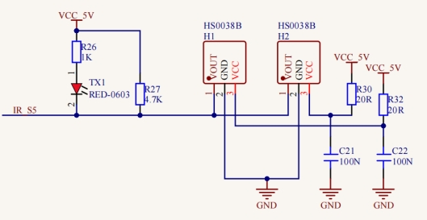
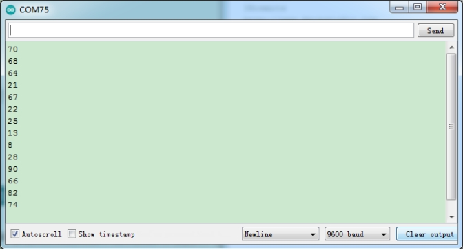

### Project 10 IR Remote Control

**1.Description**


There is no doubt that the IR remote control can be seen everywhere in our daily life, which  is used to control a variety of appliances, including TVS, stereos, VCRS and satellite receivers.  

It  is composed of an infrared remote control and an infrared receivermodule as well as a single chip microcomputer that can decode. 

The IR receiver module mainly consists of an infrared receiving head, which is a device integrating reception, amplification and demodulation. Its internal IC can complete all the work from the infrared receiving output compatible with TTL level signal, the output is digital signal.

The IR receiver module has solely three pins, signal line (the infrared receiver is connected with the GPIO6 pin of the single chip microcomputer), VCC and GND. It is distinctly convenient to connect and communicate with pico and other microcontrollers. 

**2.Working Principle**

The 38KHz carrier signal transmitted by the IR remote control is encoded by the coding chip in the remote, which is (NEC protocol) composed of a series of preamblecode, user code, user inverse code, data code as well as data inverse code. 

The time interval of the pulses is used to distinguish between 0 and 1 signals (560us low +560us high is signal 0, 560us low +1680us high is signal 1), and the code is composed of these 0 and 1 signals. 

The user code of the same remote control is unchanged, and the key pressed by the remote control can be distinguished by the data difference. 

When pressing the key , the remote control sends out the infrared carrier signal. When the IR receiver obtains the signal, the program decodes the signal and determines which key is pressed.

The MCU is decoded by the received 01 signal to determine which key to press. In order to facilitate the reception of data, we have mounted the IR receiving heads on the car. Here we connect them to GPIO6 of the Pico.



**3.Test Code**

```c
#include "ir.h"
IR IRreceive(6);//IR receiver is connected to GP6

void setup()
{
}

void loop() 
{
  int key = IRreceive.getKey();
  if (key != -1) 
  {
    Serial.println(key);
  }
}
```

**4.Test Result** 

After uploading the test code successfully, power up and open the serial monitor. Send signals with the remote control to the IR receiver sensor to see the key value of the corresponding button. If the button is pressed for a long time, garbled characters may appear.




**5.Code Explanation** 

| #include "ir.h"                      | Import the library file of the IR receiver                   |
| ------------------------------------ | ------------------------------------------------------------ |
| IR IRreceive(6);                     | The IR receiver is connected to GPIO6                        |
| int key = IRreceive.getKey();        | Define an integer variable to save the key value of the IR remote control |
| if (key != -1)                       | If the IR remote control signal is not received, the returned key value is -1, so we print when the value is not equal to -1 |
| Serial.println(key);                 | Newline print the key value                                  |
| if (key == 64 && flag == true)       | If the OK key is pressed and flag is true,  set flag to false for next extinction |
| else if (key == 64 && flag == false) | If the OK key is pressed and the flag is false,  set flag to true for next lighting |

**6.Expanded Project Use a OK button to control the seven-color LED**

```c
#include "MecanumCar_v2.h"
mecanumCar mecanumCar(20, 21);  //sda-->20,scl-->21
#include "ir.h"
IR IRreceive(6);//IR receiver is connected to GP6
bool flag = true;

void setup()
{
  mecanumCar.Init();//Initialize the motors and the seven-color LEDs
}

void loop() 
{
  int key = IRreceive.getKey();
  if (key == 64 && flag == true) 
  {
    mecanumCar.right_led(1);
    mecanumCar.left_led(1);
    flag = false;
  }
  else if (key == 64 && flag == false) 
  {
    mecanumCar.right_led(0);
    mecanumCar.left_led(0);
    flag = true;
  }
}
```

