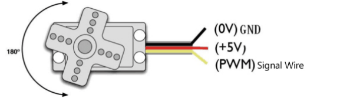

### Project 3 Servo

**1.Description**

For those DIY smart cars, they often have the function of automatic obstacle avoidance. In the DIY process, we need a servo to control the ultrasonic module to rotate left and right, and then detect the distance between the car and the obstacle, so as to control the car to avoid the obstacle. 

If other microcontrollers are used to control the rotation of the servo, we need to set a certain frequency and a certain width of pulse to control the servo angle. But if arduino is used to control the servo angle, we only need to set the control angle in the develop environment where the corresponding pulse will be automatically set to control the servo rotation. In this project, you will learn how to control the servo to rotate back and forth between 0° and 180°.

**2.Component Knowledge**

Angle range：180°（There are 360°servo，180°servo，90°servo）

Driver voltage：3.3V or 5V

The pins are usually three wires




GND： This is a grounded pin, which is brown.

VCC:     This is a pin connected to +5v（3.3V）power, which is red.

S：       This is a pin controlled by PWM signal, which is orange.(Here we connect it to GPIO2

**3.Control Principle**

The rotation angle of servo is controlled by regulating the duty cycle of PWM (Pulse-Width Modulation) signal. The standard cycle of PWM signal is 20ms (50Hz). Theoretically, the width is distributed between 1ms-2ms, but in fact, it's between 0.5ms-2.5ms. The width corresponds to the rotation angle from 0° to 180°. But note that for different brand servo, the same signal may have different rotation angle. 

**4.Test Code**

```c
#define  servo_pin  2      //The servo is connected to GP2

void setup() 
{
  pinMode(servo_pin, OUTPUT);    //Set the servo pin mode to output
}

void loop() 
{
  for (uint8_t angle = 0; angle < 180; angle++)
  {
    servopulse(servo_pin, angle);
  }
  for (uint8_t angle = 180; angle > 0; angle--)
  {
    servopulse(servo_pin, angle);
  }
}

void servopulse(int pin, int myangle) //Impulse function 
{   
  int pulsewidth = map(myangle, 0, 180, 500, 2500); //Map angle to pulse width
  //Output pulse
  digitalWrite(pin, HIGH);        //Set the servo interface to high level 
  delayMicroseconds(pulsewidth);  //Delay the number of ms of pulse width value
  digitalWrite(pin, LOW);         //Set the servo interface to low level 
  delay(20 - pulsewidth / 1000);  //Cycle is 20 ms
}
```

**5.Test Result**

After compiling and uploading the code, then power on, we will see that the servo will turn back and forth from 0 degrees to 180 degrees .

**6.Code Explanation** 

| #define servo_pin 2              | Define the pin number of the servo to GPIO2                  |
| -------------------------------- | ------------------------------------------------------------ |
| pinMode(servo_pin,OUTPUT);       | Set the pin connecting the servo to output mode, after setting, high/low level can be output. |
| servopulse(servo_pin, angle);    | Impulse function that causes the servo  connected to the servo_pin to be rotated to the angle position. |
| map(myangle, 0, 180, 500, 2500); | A mapping function that maps myAngle from 0 to 180 to 500 to 2500, such as 1500 when myAngle is 90. |
| digitalWrite(pin, HIGH);         | The first parameter pin is the                               |
| digitalWrite(pin, LOW);          | output pin. When the second parameter is HIGH, then output high level (3.3V). When it is LOW, output low level (0V). |
| delayMicroseconds(pulsewidth);   | Delay pulsewidth in ms                                       |

**7.Expanded Project Use servo library to drive**

```c
#include <Servo.h>
Servo myservo;    //Define an instance of a servo

void setup() 
{
  myservo.attach(2);    //The pin of the servo is connected to GPIO2
}

void loop() 
{
  for (uint8_t angle = 0; angle < 180; angle++)//From 0 to 180 degrees
  {
    myservo.write(angle); //Rotate to angle 
delay(15);  //Wait for a while 
  }
  for (uint8_t angle = 180; angle > 0; angle--)//From 0 to 180 degrees
  {
    myservo.write(angle); //Rotate to angle
    delay(15);
  }
}
```

After burning the code, the servo rotates back and forth between 0 and 180 degrees.