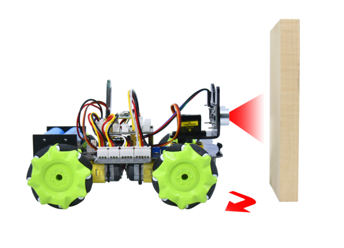

### Project 9 Ultrasonic Avoidance Smart Car



**1.Description**

Ultrasonic avoidance smart car is used to control the car motion state, so as to achieve obstacle avoidance by using the ultrasonic sensor detecting the obstacles distance. 

**2.Flow Diagram**


**3.Test Code**

```c
#include "MecanumCar_v2.h"
#include "Servo.h"

mecanumCar mecanumCar(20, 21);  //sda-->20,scl-->21
Servo myservo;    //Define an instance of a servo

#define EchoPin  4  //ECHO to GPIO4
#define TrigPin  3  //TRIG to GPIO3

int distance_M, distance_L, distance_R;

void setup() 
{
  myservo.attach(2);    //The pins of the servo is connected to GP2
  pinMode(EchoPin, INPUT);    //The ECHO pin is set to input mode
  pinMode(TrigPin, OUTPUT);   //The TRIG pin is set to output mode
  myservo.write(90); //Rotate to 90 degrees
  delay(100);
}

void loop() 
{
  distance_M = get_distance();  //Get the distance and save in the distance variable  
  if (distance_M < 20) //When the distance in front is less than 20cm
  {
     mecanumCar.Stop();  //Robot stop
     delay(500); //Delay in 500ms
     myservo.write(180);  //Ultrasonic cradle head turns left
     delay(500); //Delay in 500ms
     distance_L = get_distance();  //Assign the left ultrasonic distance to variable a1
     delay(100); //Read values when stable
     myservo.write(0); //Ultrasonic cradle head turns right
     delay(500); //Delay in 500ms
     distance_R = get_distance(); //Assign the right ultrasonic distance to variable a2
     delay(100); //Read values when stable
  	 myservo.write(90);  //Return to the 90 degree position
     delay(500);
     if (distance_L > distance_R) //When the distance on the left is greater than right
     { 
        mecanumCar.Turn_Left();  //Robot turns left
        delay(300);  //Turn left 700ms
     } 
     else 
     {
        mecanumCar.Turn_Right(); //Robot turns right
        delay(300);
     }
  }
  else 
  { //If the distance in front >=20cm时，the robot will advance
     mecanumCar.Advance(); //Advance
  }
}

int get_distance(void)  //Ultrasonic detects the distance
{   
  int dis;
  digitalWrite(TrigPin, LOW);
  delayMicroseconds(2);
  digitalWrite(TrigPin, HIGH); //Give the TRIG a high level of at least 10 µ s to trigger
  delayMicroseconds(10);
  digitalWrite(TrigPin, LOW);
  dis = pulseIn(EchoPin, HIGH) / 58.2; //Work out the distance
  delay(30);
  return dis;
}
```

**4.Test Result**

After uploading the code successfully and power up, and the car can automatically avoid obstacles. Note that the speed can’t be too large.

The car will stop when encountering obstacles in front of it and the servo cradle head will rotate left to detect the left distance, then rotate right to detect the right distance. Then judge the distance between the obstacles on the left and the right, the car will turn along the farther side, and then continue to drive. 

**5.Code Explanation**

| myservo.write(90);                                   | Make the servo rotate to 90 degrees                          |
| ---------------------------------------------------- | ------------------------------------------------------------ |
| int distance = get_distance();                       | Define an integer variable to store the measured distance, and then control the car driving according to it |
| myservo.write(180);<br>distance_L = get_distance();  | Ultrasonic turns left to detect and save the distance        |
| myservo.write(180);<br/>distance_L = get_distance(); | Ultrasonic turns right to detect and save the distance       |
| myservo.write(90);                                   | The servo return to the 90 degrees position                  |
| if (distance_L > distance_R)                         | Judge the left and right distance                            |
| else<br>{<br>      mecanumCar.Advance();<br>}        | If the front distance is bigger than 20cm, the car will advance |

