# 4. Python

## 4.1 Data download

Python information contains library files、project code and firmware,please click to download for follow-up study.

Data download:  [Python](./Python.7z)  

## 4.2 Download Thonny

**For Windows**——**Operating System: Windows 10**

Enter [Thonny IDE official](https://thonny.org) to download the Thonny for Windows version. 

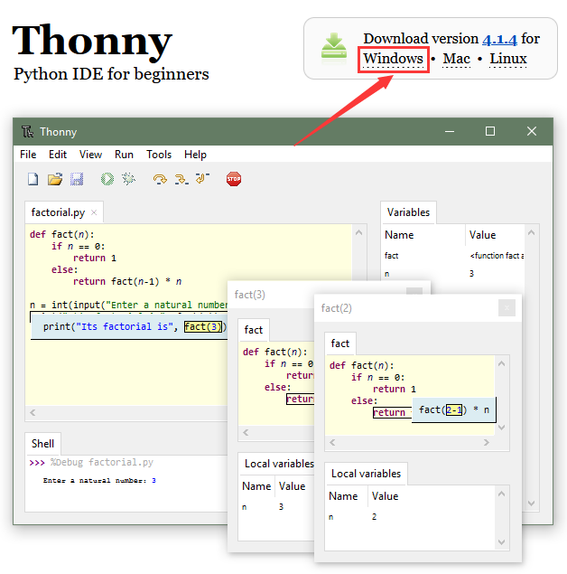

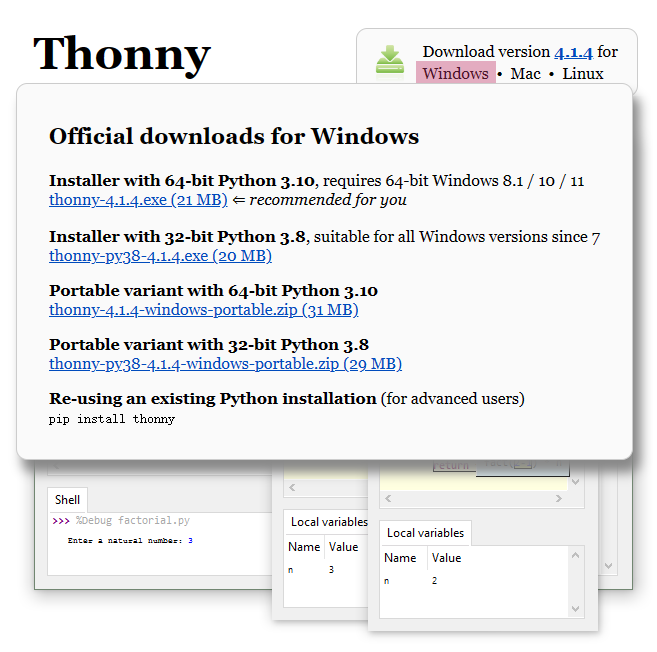

**For MAC**

Please refer to Windows.

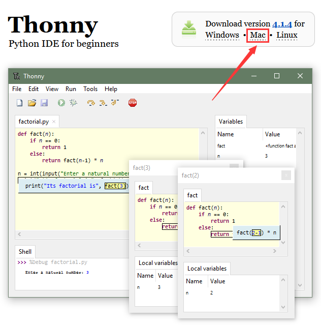

## 4.3 Install Thonny

Thonny supports two installation methods:

- Thonny+Python package

  Python IDE and Thonny are packaged together and can be directly installed and used. It is fast and easy so is recommended for beginners. There are also two ways to install this package:

  - Installer

  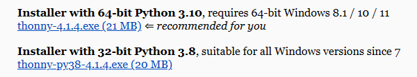

  - Portable variant

  

- Thonny only

  Thonny is actually a package of python. When the user already has a python environment, click `pip install thonny` to install Thonny only, which is more suitable for developers.

Please download the corresponding version according to your requirements.

### 4.3.1 Installer

Download the app according to your operation system. Here we demonstrate under 64bit Windows 10 to download `Installer with 64-bit Python 3.10`.

(1) Clickand you will see “Select Setup Install Mode”. Choose **Install for me only**.

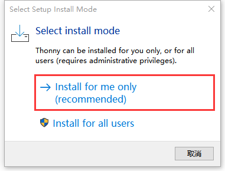

(2) **Next**.

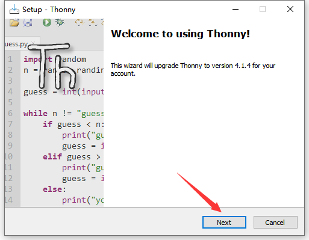

(3) Tick **I accept the agreement** and Click **Next**.

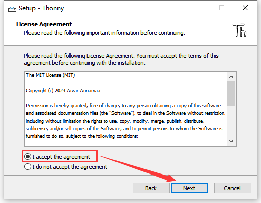

(4) The default installation path is in Disk C. You may click **Browse...** to choose another disk. And then click **Next**.

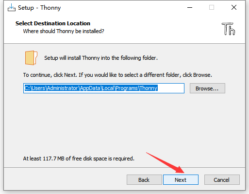

(5) By default, a shortcut to the program is created in the Start menu folder. Click **Browse...** to set another path for the shortcut and **Next**.

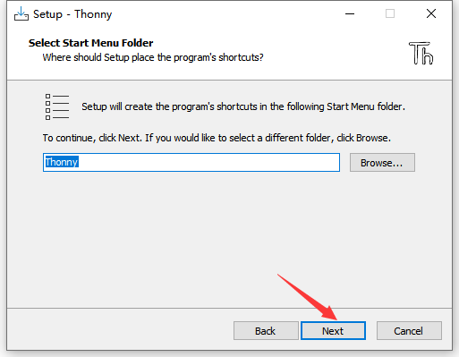

(6) Tick **Create desktop icon** and **Next**.

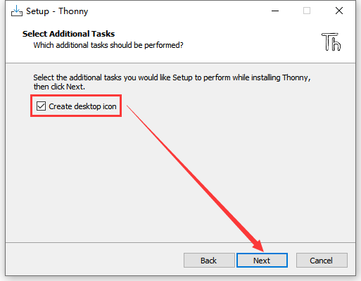

(7) Install.

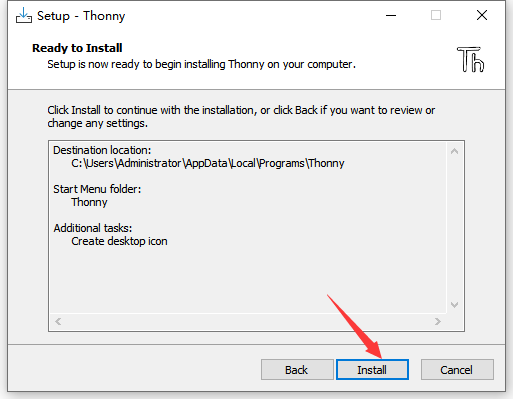

(8) “**Finish**”!

(9) Back to the desktop and start Thonny to choose a language.

(10) Done.

### 4.3.2 Portable Variant

Download the app according to your operation system. Here we demonstrate under 64bit Windows 10 to download `Installer with 64-bit Python 3.10`.

(1) Clickto start Thonny and choose a language.

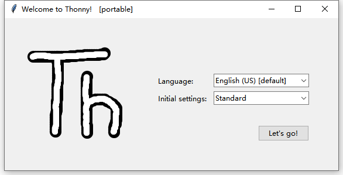

(2) Done.

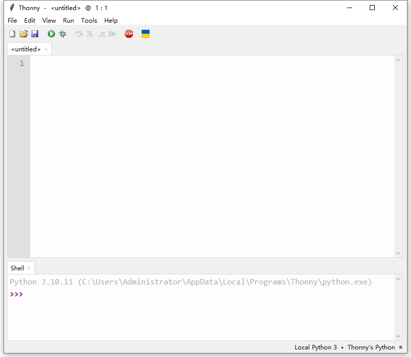

## 4.4 Burn Firmware (Important)

To run MicroPython code on Pico, it is necessary to burn MicroPython firmware to Pico.

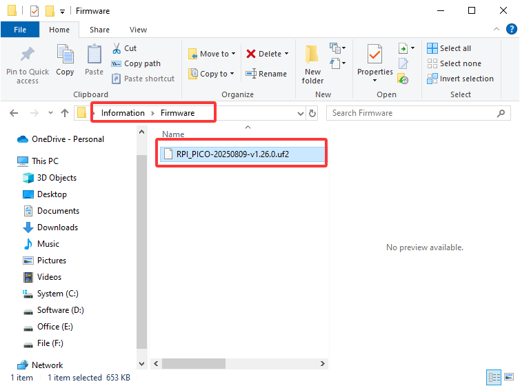

A. Connect the board to your computer via Micro USB.

B. Press and hold the white button (BOOTSEL) on “Raspberry Pi Pico”. Then, connect the Raspberry Pi Pico to the computer via a microUSB cable.

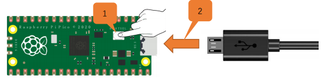

C. Release the button. After connection, open [Device Manager] and your computer will automatically recognize the removable disk (RPI-RP2) as follows:

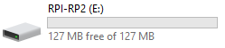

D. Copy the `RPI_PICO-20250809-v1.26.0.uf2` file from the “Firmware” folder to the removable disk (RPI-RP2), just like copying a file to a USB flash drive, and then wait for it to complete.

E. After burning the firmware, Raspberry Pi Pico will restart. After that, you can run Micropython.

## 4.5 Homepage

Click **View** and tick **Files** to open the file manager.

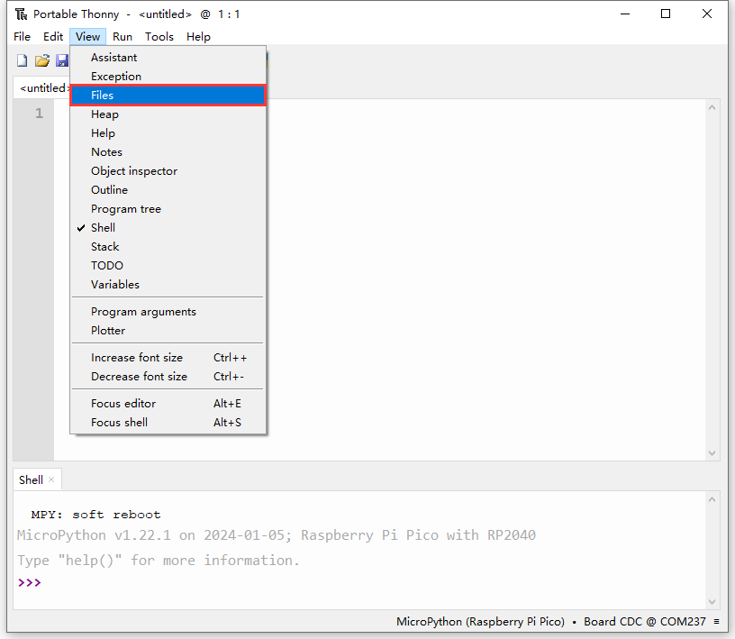

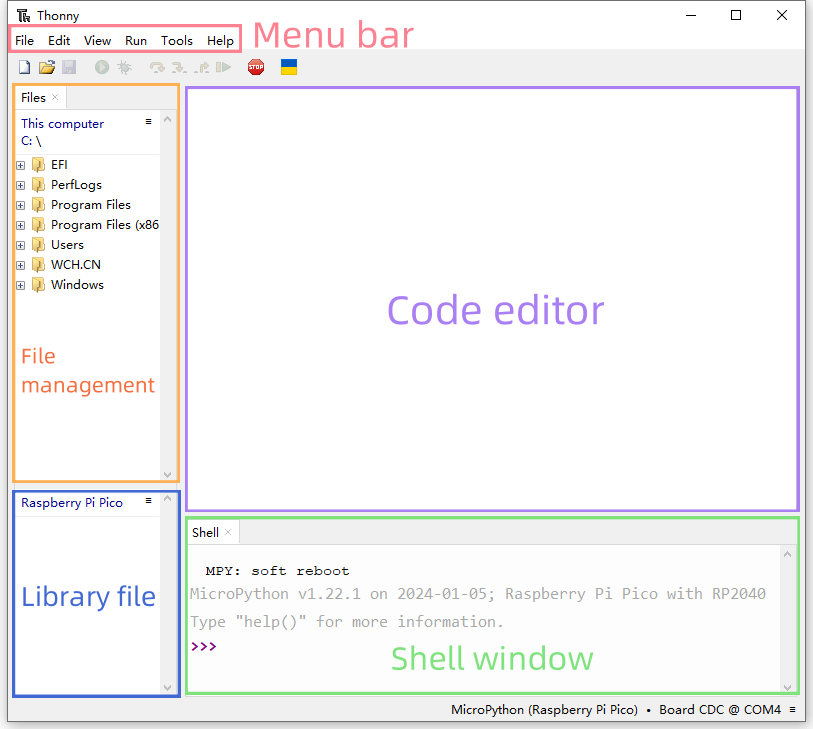

## 4.6 Toolbar

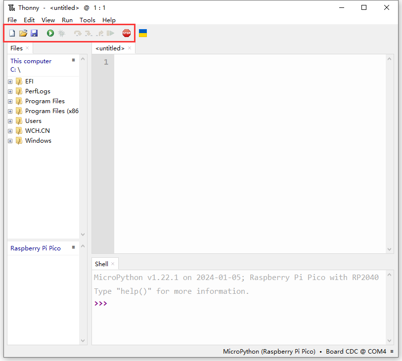

|                  Icon                  |       Function       |
| :------------------------------------: | :------------------: |
|  |         New          |
|  |       Open...        |
|  |         Save         |
|  |  Run current script  |
|  | Debug current script |
|  |      Step over       |
|  |      Step into       |
|  |       Step out       |
|  |        Resume        |
|  | Stop/Restart backend |

## 4.7 Connect Pico to Thonny

Connect the Pico development board to the computer, then set the development board to Pico and select the port. 

Click `Tools`-->`Options...`

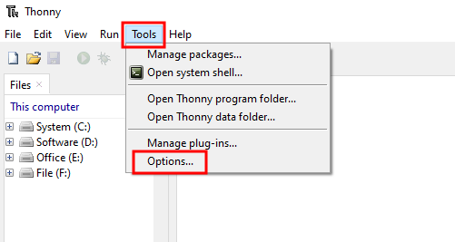

Select `Interpreter` , then set the development board to `MicroPython(Raspberry Pi Pico)`, and choose the ports automatically recognized, and click `OK`.

After connection, “Raspberry Pi Pico” will appear on the left side of Thonny and there will also be a prompt in the lower right corner.

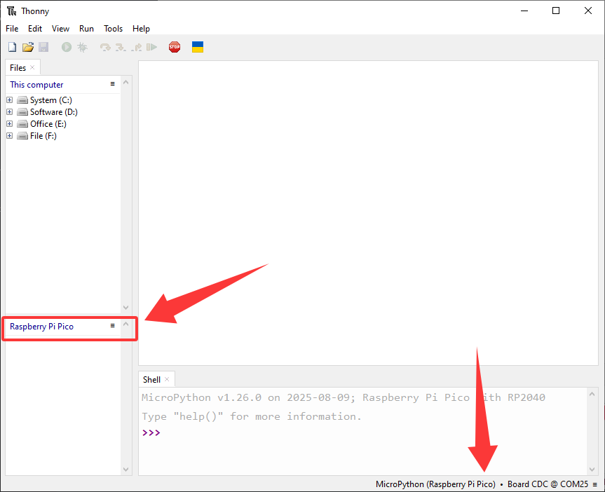

## 4.8 Load Code from Computer

Note: You need to download the required data files from `1.Download code and library files` and extract them to your desktop.

Click Files –> This computer, open the file `Resources`.

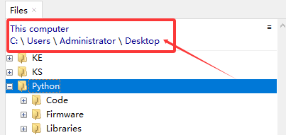

Enter `codes` and you can see the codes. Click it to open the file in Thonny.

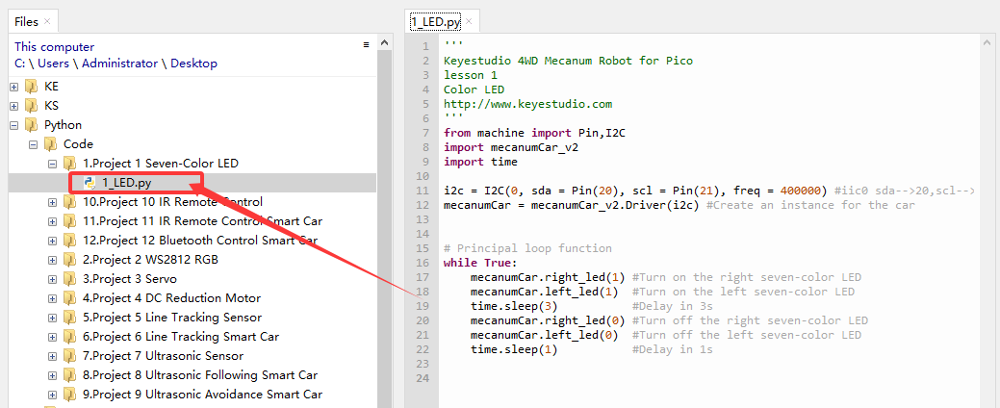

## 4.9 Upload Library to Pico

Errors may be reported during running code without saving the library to Pico.

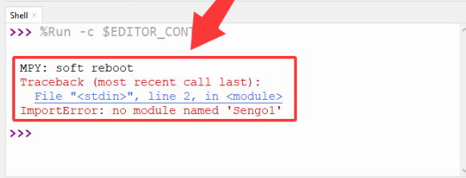

**Add library:** 

In Files, open `Resources` –> `lib` to check library:

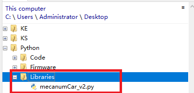

Choose `mecanumCar_v2.py` to “Upload to/”.

After that, `mecanumCar_v2.py` is displayed in “Raspberry Pi Pico”.

## 4.10 Project