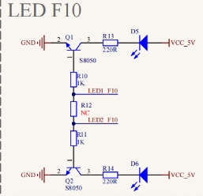
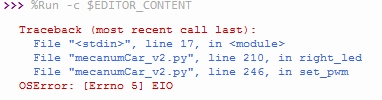

### Project 1 Seven-Color LED

**1.Description**


First we're going to finish the classic Arduino lit LED. Here we will use seven-color LEDs, which are components with a white appearance and display seven colors. 

Furthermore, the module can automatically flash the built-in colors, which can be used to make charming lighting effects. It is the same as the normal LED driver, which will automatically flash seven colors when we input high level and stop flashing when at low level.

We have integrated the seven-color LEDs into our motor driver board. In the first project, we will use a basic test code to control it to blink for 3 seconds, off for 1 second to achieve the control effect.

You can also change the time of the LEDs on and off in your code to achieve different duration effects. When in control, the LEDs will be on if S end is high level; otherwise, it will go off. 

**2.Component Knowledge**




The two seven-color LEDs are controlled by triode respectively, and the signal end is respectively connected to P5.4 and P5.5, thereby we solely need to control the two pins to output high and low levels to control the  LEDs.

**3.Test Code**

```
from machine import Pin,I2C
import mecanumCar_v2
import time

i2c = I2C(0, sda = Pin(20), scl = Pin(21), freq = 400000) #iic0 sda-->20,scl-->21
mecanumCar = mecanumCar_v2.Driver(i2c) #Create an instance for the car

# Principal loop function
while True:
    mecanumCar.right_led(1) #Turn on the right seven-color LED
    mecanumCar.left_led(1)  #Turn on the left seven-color LED
    time.sleep(3)           #Delay in 3s
    mecanumCar.right_led(0) #Turn off the right seven-color LED
    mecanumCar.left_led(0)  #Turn off the left seven-color LED
    time.sleep(1)           #Delay in 1s
```

**4.Test Result** 

First, make sure the library files are installed, otherwise the code will fail to compile. Here we use the library file MecanumCar_v2, please refer to the develop environment for installation. 

Clickto run the code, we can see the two seven-color LEDs flashing for 3s and then put out 1s, then blink again for 3s to go out for 1s so .

Note: Power on the DIP switch on the driver base board, if there is no open, will appear, this is because the base board without electricity, pico doesn’t detect i2c device. 

**5.Code Explanation** 

| from machine import Pin,I2C                               | Import pins and I2C functions of machine module              |
| --------------------------------------------------------- | ------------------------------------------------------------ |
| import mecanumCar_v2                                      | Import mecanumCar_v2 module to drive the car                 |
| import time                                               | Import time module                                           |
| i2c = I2C(0, sda = Pin(20), scl = Pin(21), freq = 400000) | Create i2C class instance to set i2C communication pins and frequency, sda is connected to GPIO20, scl is connected to GPIO21, frequency is 400KHz |
| while True:                                               | This is a main loop, which is equivalent to while(1).        |
| mecanumCar.right_led(1);<br>mecanumCar.right_led(0);      | When the parameter is 1, output high level to the signal pin of the right seven-color LED, it will be on; When is 0, output low level to the signal pin, it will be off. |
| mecanumCar.left_led(1);<br>mecanumCar.left_led(0);        | When the parameter is 1, output high level to the signal pin of the left seven-color LED, it will be on; When is 0, output low level to the signal pin, it will be off. |
| time.sleep(1)                                             | Delay in 1s<br>Sleep_ms (ms) indicates the number of milliseconds delayed.<br>Sleep_us (us) indicates the number of microseconds delayed |

