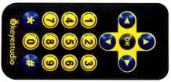
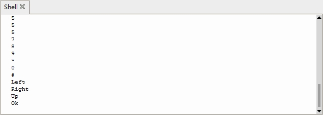

### Project 10 IR Remote Control

**1.Description**



There is no doubt that the IR remote control can be seen everywhere in our daily life, which  is used to control a variety of appliances, including TVS, stereos, VCRS and satellite receivers.  

It  is composed of an infrared remote control and an infrared receivermodule as well as a single chip microcomputer that can decode. 

The IR receiver module mainly consists of an infrared receiving head, which is a device integrating reception, amplification and demodulation. Its internal IC can complete all the work from the infrared receiving output compatible with TTL level signal, the output is digital signal.

The IR receiver module has solely three pins, signal line (the infrared receiver is connected with the GPIO6 pin of the single chip microcomputer), VCC and GND. It is distinctly convenient to connect and communicate with pico and other microcontrollers. 

**2.Working Principle**

The 38KHz carrier signal transmitted by the IR remote control is encoded by the coding chip in the remote, which is (NEC protocol) composed of a series of preamblecode, user code, user inverse code, data code as well as data inverse code. 

The time interval of the pulses is used to distinguish between 0 and 1 signals (560us low +560us high is signal 0, 560us low +1680us high is signal 1), and the code is composed of these 0 and 1 signals. 

The user code of the same remote control is unchanged, and the key pressed by the remote control can be distinguished by the data difference. 

When pressing the key , the remote control sends out the infrared carrier signal. When the IR receiver obtains the signal, the program decodes the signal and determines which key is pressed.

The MCU is decoded by the received 01 signal to determine which key to press. In order to facilitate the reception of data, we have mounted the IR receiving heads on the car. Here we connect them to GPIO6 of the Pico.


**3.Test Code**

```
import utime
from machine import Pin

ird = Pin(6,Pin.IN) #IR receiver pin interface is GPIO6

#IR decoder dictionary
act = {"1": "LLLLLLLLHHHHHHHHLHHLHLLLHLLHLHHH","2": "LLLLLLLLHHHHHHHHHLLHHLLLLHHLLHHH","3": "LLLLLLLLHHHHHHHHHLHHLLLLLHLLHHHH",
       "4": "LLLLLLLLHHHHHHHHLLHHLLLLHHLLHHHH","5": "LLLLLLLLHHHHHHHHLLLHHLLLHHHLLHHH","6": "LLLLLLLLHHHHHHHHLHHHHLHLHLLLLHLH",
       "7": "LLLLLLLLHHHHHHHHLLLHLLLLHHHLHHHH","8": "LLLLLLLLHHHHHHHHLLHHHLLLHHLLLHHH","9": "LLLLLLLLHHHHHHHHLHLHHLHLHLHLLHLH",
       "0": "LLLLLLLLHHHHHHHHLHLLHLHLHLHHLHLH","Up": "LLLLLLLLHHHHHHHHLHHLLLHLHLLHHHLH","Down": "LLLLLLLLHHHHHHHHHLHLHLLLLHLHLHHH",
       "Left": "LLLLLLLLHHHHHHHHLLHLLLHLHHLHHHLH","Right": "LLLLLLLLHHHHHHHHHHLLLLHLLLHHHHLH","Ok": "LLLLLLLLHHHHHHHHLLLLLLHLHHHHHHLH",
       "*": "LLLLLLLLHHHHHHHHLHLLLLHLHLHHHHLH","#": "LLLLLLLLHHHHHHHHLHLHLLHLHLHLHHLH"}

def read_ircode(ird):
    wait = 1
    complete = 0
    seq0 = []
    seq1 = []

    while wait == 1:
        if ird.value() == 0:
            wait = 0
    while wait == 0 and complete == 0:
    	 start = utime.ticks_us()
        while ird.value() == 0:
            ms1 = utime.ticks_us()
        diff = utime.ticks_diff(ms1,start)
        seq0.append(diff)
        while ird.value() == 1 and complete == 0:
            ms2 = utime.ticks_us()
            diff = utime.ticks_diff(ms2,ms1)
            if diff > 10000:
                complete = 1
        seq1.append(diff)

    code = ""
    for val in seq1:
        if val < 2000:
            if val < 700:
                code += "L"
            else:
                code += "H"
    # print(code)
    command = ""
    for k,v in act.items():
        if code == v:
            command = k
    if command == "":
        command = code
    return command

while True:
    command = read_ircode(ird)
    print(command)
    utime.sleep(0.5)
```

**4.Test Result** 

After clicking to run the test code and powering up. Send signals with the remote control to the IR receiver sensor to see the key value of the corresponding button. If the button is pressed for a long time, garbled characters may appear.



**5.Code Explanation** 

| import utime                                                 | Import utime module                                          |
| ------------------------------------------------------------ | ------------------------------------------------------------ |
| from machine import Pin                                      | Import the Pin functions from the machine                    |
| ird = Pin(6,Pin.IN)                                          | The IR receiver is connected to GPIO6 and set to input mode  |
| act                                                          | act is a dictionary of decoded: definitions https://docs.python.org/3/tutorial/datastructures.html#dictionaries |
| def read_ircode(ird):                                        | Define an IR remote control decoding function, parameter is the IR receiver pin |
| seq0 = []<br>seq1 = []                                       | Define two empty lists to store the time of low level and high level respectively: |
| while wait == 1:<br>   if ird.value() == 0<br>      wait = 0 | Wait for the low level to come                               |
| start = utime.ticks_us()<br>    while ird.value() == 0:<br>      ms1 = utime.ticks_us() | After the low level arrives, wait for the high level to appear, and record the time, utime.ticks_us() returns the number of microseconds to run |
| diff = utime.ticks_diff(ms1,start)<br>seq0.append(diff)      | diff records how long the low level holds and then adds it to seq0 using the append() method of the list |
| ms2 = utime.ticks_us()<br>diff=utime.ticks_diff(ms2,ms1)     | When the high level comes, it waits for the low level to appear and records the time. Diff records the time when the high level is held. Utime. ticks_diff returns the time difference |
| if diff > 10000:                                             | If the time is too long, you are forced to exit              |
| seq1.append(diff)                                            | Add the append() method of the high level holdtime to seq1   |
| for val in seq1:                                             | Loop through the time recorded in seq1, because NEC protocol type signal 0 and signal 1 have the same low level time, the difference is high level time |
| if val < 2000:<br>    if val < 700:<br>       code += "L"\   | If the list contains less than 700 elements, add "L" to the string code. |
| else:<br>    code += "H"                                     | If the list contains more than 700 elements and less than 2000 elements, add "H" after the string code. |
| for k,v in act.items():                                      | Iterate over the keys and values of the act dictionary       |
| if code == v:<br>     command = k                            | If the same value is reached, assign the key to the string variable command and save it |
| if code == " ":<br/>     command = code                      | If command is empty, it indicates that the decoding failed, and the garbled code is assigned to command |
| return command                                               | Return this command value                                    |
| while True: command = read_ircode(ird)                       | Detect in a cyclical, and decode                             |
| print(command)                                               | Print the key value                                          |

**6.Expanded Project Use a OK button to control the seven-color LED**

```
from machine import Pin,I2C
import mecanumCar_v2
import time

i2c = I2C(0, sda = Pin(20), scl = Pin(21), freq = 400000) #iic0 sda-->20,scl-->21
mecanumCar = mecanumCar_v2.Driver(i2c) #Create a driver instance for the car

ird = Pin(6,Pin.IN) #IR receiver pin interface is GPIO6

#IR decoder dictionary
act = {"1": "LLLLLLLLHHHHHHHHLHHLHLLLHLLHLHHH","2": "LLLLLLLLHHHHHHHHHLLHHLLLLHHLLHHH","3": "LLLLLLLLHHHHHHHHHLHHLLLLLHLLHHHH",
       "4": "LLLLLLLLHHHHHHHHLLHHLLLLHHLLHHHH","5": "LLLLLLLLHHHHHHHHLLLHHLLLHHHLLHHH","6": "LLLLLLLLHHHHHHHHLHHHHLHLHLLLLHLH",
       "7": "LLLLLLLLHHHHHHHHLLLHLLLLHHHLHHHH","8": "LLLLLLLLHHHHHHHHLLHHHLLLHHLLLHHH","9": "LLLLLLLLHHHHHHHHLHLHHLHLHLHLLHLH",
       "0": "LLLLLLLLHHHHHHHHLHLLHLHLHLHHLHLH","Up": "LLLLLLLLHHHHHHHHLHHLLLHLHLLHHHLH","Down": "LLLLLLLLHHHHHHHHHLHLHLLLLHLHLHHH",
       "Left": "LLLLLLLLHHHHHHHHLLHLLLHLHHLHHHLH","Right": "LLLLLLLLHHHHHHHHHHLLLLHLLLHHHHLH","Ok": "LLLLLLLLHHHHHHHHLLLLLLHLHHHHHHLH",
       "*": "LLLLLLLLHHHHHHHHLHLLLLHLHLHHHHLH","#": "LLLLLLLLHHHHHHHHLHLHLLHLHLHLHHLH"}

def read_ircode(ird):
    wait = 1
    complete = 0
    seq0 = []
    seq1 = []
      while wait == 1:
        if ird.value() == 0:
            wait = 0
    while wait == 0 and complete == 0:
        start = time.ticks_us()
        while ird.value() == 0:
            ms1 = time.ticks_us()
        diff = time.ticks_diff(ms1,start)
        seq0.append(diff)
        while ird.value() == 1 and complete == 0:
            ms2 = time.ticks_us()
            diff = time.ticks_diff(ms2,ms1)
            if diff > 10000:
                complete = 1
        seq1.append(diff)

    code = ""
    for val in seq1:
        if val < 2000:
            if val < 700:
                code += "L"
            else:
                code += "H"
    # print(code)
    command = ""
    for k,v in act.items():
        if code == v:
            command = k
    if command == "":
        command = code
    return command

while True:
    command = read_ircode(ird)
     if command == "Left":
        mecanumCar.left_led(1)
    elif command == "Right":
        mecanumCar.right_led(1)
    elif command == "Ok":
        mecanumCar.left_led(0)
        mecanumCar.right_led(0)
```

Turn on the switch and power up, then run the code, press the key of the IR remote control to light up the left seven-color LED, then press the key  to light up the right seven-color LED, press the key will close the two seven-color LEDs.
