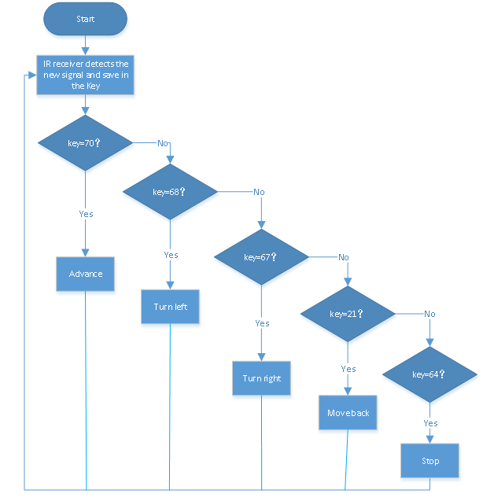

### Project 11 IR Remote Control Smart Car


**1.Description** 

In this project, we will work to control the car using an IR remote control.

**2.Flow Diagram**



**3.Test Code**

```
from machine import Pin,I2C
import mecanumCar_v2
import time

i2c = I2C(0, sda = Pin(20), scl = Pin(21), freq = 400000) #iic0 sda-->20,scl-->21
mecanumCar = mecanumCar_v2.Driver(i2c) #Create a driver instance for the car

ird = Pin(6,Pin.IN) #IR receiver pin interface is GPIO6

#IR decoder dictionary
act = {"1": "LLLLLLLLHHHHHHHHLHHLHLLLHLLHLHHH","2": "LLLLLLLLHHHHHHHHHLLHHLLLLHHLLHHH","3": "LLLLLLLLHHHHHHHHHLHHLLLLLHLLHHHH",
       "4": "LLLLLLLLHHHHHHHHLLHHLLLLHHLLHHHH","5": "LLLLLLLLHHHHHHHHLLLHHLLLHHHLLHHH","6": "LLLLLLLLHHHHHHHHLHHHHLHLHLLLLHLH",
       "7": "LLLLLLLLHHHHHHHHLLLHLLLLHHHLHHHH","8": "LLLLLLLLHHHHHHHHLLHHHLLLHHLLLHHH","9": "LLLLLLLLHHHHHHHHLHLHHLHLHLHLLHLH",
       "0": "LLLLLLLLHHHHHHHHLHLLHLHLHLHHLHLH","Up": "LLLLLLLLHHHHHHHHLHHLLLHLHLLHHHLH","Down": "LLLLLLLLHHHHHHHHHLHLHLLLLHLHLHHH",
       "Left": "LLLLLLLLHHHHHHHHLLHLLLHLHHLHHHLH","Right": "LLLLLLLLHHHHHHHHHHLLLLHLLLHHHHLH","Ok": "LLLLLLLLHHHHHHHHLLLLLLHLHHHHHHLH",
       "*": "LLLLLLLLHHHHHHHHLHLLLLHLHLHHHHLH","#": "LLLLLLLLHHHHHHHHLHLHLLHLHLHLHHLH"}

def read_ircode(ird):
    wait = 1
    complete = 0
    seq0 = []
    seq1 = []

    while wait == 1:
    	 if ird.value() == 0:
            wait = 0
    while wait == 0 and complete == 0:
        start = time.ticks_us()
        while ird.value() == 0:
            ms1 = time.ticks_us()
        diff = time.ticks_diff(ms1,start)
        seq0.append(diff)
        while ird.value() == 1 and complete == 0:
            ms2 = time.ticks_us()
            diff = time.ticks_diff(ms2,ms1)
            if diff > 10000:
                complete = 1
        seq1.append(diff)

    code = ""
    for val in seq1:
        if val < 2000:
            if val < 700:
                code += "L"
            else:
                code += "H"
    # print(code)
    command = ""
    for k,v in act.items():
        if code == v:
            command = k
    if command == "":
        command = code
    return command

while True:
    command = read_ircode(ird)
    if command == "Up":
    	 mecanumCar.Advance()
    elif command == "Down":
        mecanumCar.Back()
    elif command == "Left":
        mecanumCar.Turn_Left()
    elif command == "Right":
        mecanumCar.Turn_Right()
    elif command == "Ok":
        mecanumCar.stop()
```

**4.Test Result**

Uploading the test code and powering up. When we press the buttonon the remote control, the car moves forward, then , the car turns left, ,the car moves back,, the car turns right,, the car stops.

**5.Code Explanation**

| command = read_ircode(ird) | IR remote decodes, and the key values will be saved in command |
| -------------------------- | ------------------------------------------------------------ |
| if command == "Up":        | The car will go forward                                      |
| elif command == "Down":    | The car will move back                                       |
| elif command == "Left":    | The car will turn left                                       |
| elif command == "Right":   | The car will turn right                                      |
| elif command == "Ok":      | The car will stop                                            |
