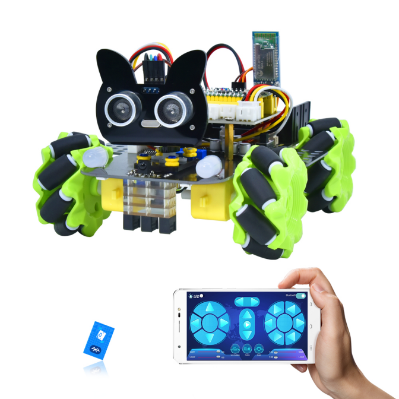
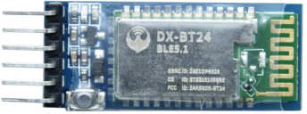
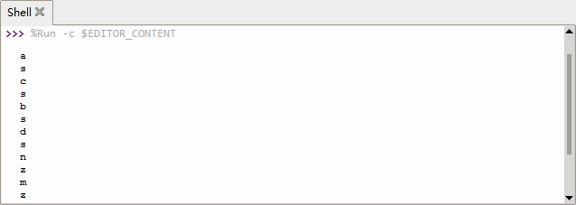

### Project 12 Bluetooth Control Smart Car



**1.Description**



There is a DX-BT24 5.1 Bluetooth module in this kit. This Bluetooth module comes with 256Kb space and complies with V5.1 BLE Bluetooth specification, which supports AT commands. Users can change parameters such as the baud rate and device name of the serial port as required. 

Furthermore, it supports UART interface and Bluetooth serial port transparent transmission, which also contains the advantages of low cost, small size, low power consumption and high sensitivity for sending and receiving. Notably, it solely needs a few peripheral components to realize its powerful functions.  

In this project, we will use the BT24 Bluetooth module to combine all modules of the car in one code, which contains all functions except IR remote control mentioned in the previous projects. We plan to use mobile APP to connect Bluetooth module, so as to control various functions, which is distinctly simple and convenient. 

We will work to read the control characters sent by each button through the Bluetooth connection of the APP.  

**2.Parameters**

- Bluetooth protocol： Bluetooth Specification V5.1 BLE

- Working frequency：2.4GHz ISM band
- Communication interface： UART
- Power supply：5V/3.3V
- Communication distance: 40m
- Dimension：27(L)mm x 13 (W)mm x 2(H) mm
- Bluetooth name：BT24
- Serial port parameters：9600、eight data bits, one stop bit, no check, no flow control
- Working temperature： MIN:-40℃ - MAX:+85℃

**3.Test Code**

```
from machine import Pin,UART,I2C
import mecanumCar_v2
import time

i2c = I2C(0, sda = Pin(20), scl = Pin(21), freq = 400000) #iic0 sda-->20,scl-->21
mecanumCar = mecanumCar_v2.Driver(i2c) #Create a driver class instance for the car

#Set Bluetooth serial port baud rate to 9600,8 data bits, no parity bit and 1 stop bit ，tx-->GPIO0,rx-->GPIO1
uart = UART(0,baudrate = 9600,bits = 8,parity = None,stop = 1,tx = machine.Pin(0),rx = machine.Pin(1))
buf=bytearray(6) #Define a serial port receive buffer

# Principal loop function
while True:
    if uart.any():
        uart.readinto(buf)
        #print(buf.decode())
        ble_val = chr(buf[0]) #Print the first character received
        print(ble_val)
```

**4.Test Result**

After uploading the code, plug in the Bluetooth, be careful not to plug it upside down. Connect the Bluetooth module and turn on the serial monitor. 

Aim at the Bluetooth module and press the APP button of the mobile phone. We can see the corresponding control characters of the APP button, as shown below.  



**5.Code Explanation**

| from machine import UART                                     | The serial port function can be used only after the UART serial port module is imported |
| ------------------------------------------------------------ | ------------------------------------------------------------ |
| uart = UART(0,baudrate = 9600,bits = 8,parity = None,stop = 1,tx = machine.Pin(0),rx = machine.Pin(1)) | Create a serial port example, set the serial port to 0, baud rate to 9600,8 data bits, one stop bit, no check bit, and serial port pins to 0 and 1 |
| buf=bytearray(6)                                             | Define a serial port receive buffer that can hold 6 bytes    |
| if uart.any():                                               | If there is a data                                           |
| uart.readinto(buf)                                           | Read the data into the buf                                   |
| ble_val = chr(buf[0])                                        | Convert the first byte in buf to character format and assign it to ble_val |
| print(ble_val)                                               | Print ble_val                                                |
| def map(value, fromLow, fromHigh, toLow, toHigh):            | Define a mapping function that maps 0 to 100 to the range 0 to 255 |
| mecanumCar.set_speed(speed_Upper_L = speed_temp)             | 4 parameters for the motor speed:<br>speed_Upper_L<br>speed_Lower_L<br>speed_Upper_R<br>speed_Lower_R |

**6.Comprehensive Project APP Control Smart Car**

```
from machine import Pin,UART,I2C
import mecanumCar_v2
import time

i2c = I2C(0, sda = Pin(20), scl = Pin(21), freq = 400000) #iic0 sda-->20,scl-->21
#print("STC8G1K08 address：", machine.I2C.scan(i2c))
mecanumCar = mecanumCar_v2.Driver(i2c) #Create a driver class instance for the car

#Set Bluetooth serial port baud rate to 9600,8 data bits, no parity bit and 1 stop bit，tx-->GPIO0,rx-->GPIO1
uart = UART(0,baudrate = 9600,bits = 8,parity = None,stop = 1,tx = machine.Pin(0),rx = machine.Pin(1))
buf=bytearray(6) #Define a serial port receive buffer

l_pin = Pin(16, Pin.IN)
m_pin = Pin(17, Pin.IN)
r_pin = Pin(18, Pin.IN)


def map(value, fromLow, fromHigh, toLow, toHigh):
    return (toHigh-toLow)*(value-fromLow) // (fromHigh-fromLow) + toLow


# Line Tracking
def Line_Tracking():
    while True:
        l_val = l_pin.value()
        m_val = m_pin.value()
        r_val = r_pin.value()
        if m_val == 1:
        	if l_val == 1 and r_val == 0:
                mecanumCar.Turn_Left()
            elif l_val == 0 and r_val == 1:
                mecanumCar.Turn_Right()
            else:
                mecanumCar.Advance()
        else:
            if l_val == 1 and r_val == 0:
                mecanumCar.Turn_Left()
            elif l_val == 0 and r_val == 1:
                mecanumCar.Turn_Right()
            else:
                mecanumCar.stop()
        if uart.any():
            uart.readinto(buf)
            ble_val = chr(buf[0])
            if ble_val == 's':
                mecanumCar.stop()
                break

# Ultrasonic Following
def ult_following():
    while True:
        distance = mecanumCar.get_distance()
        if distance <= 15:
            mecanumCar.Back()
        elif distance <= 25:
            mecanumCar.stop()
        elif distance <= 45:
            mecanumCar.Advance()
        else:
            mecanumCar.stop()
        if uart.any():
            uart.readinto(buf)
            ble_val = chr(buf[0])
            if ble_val == 's':
                mecanumCar.stop()
                break

# Ultrasonic Obstacle Avoidance
def ult_avoiding():
    while True:
        distance = mecanumCar.get_distance()
        if distance <= 15:
            mecanumCar.stop()
            time.sleep(0.5)
            mecanumCar.set_angle(180)
            time.sleep(0.5)
            l_distance = mecanumCar.get_distance()
            time.sleep(0.1)
            mecanumCar.set_angle(0)
            time.sleep(0.5)
            r_distance = mecanumCar.get_distance()
            time.sleep(0.1)
            mecanumCar.set_angle(90)
            time.sleep(0.5)
            if l_distance > r_distance:
                mecanumCar.Turn_Left()
                time.sleep(0.3)
            else:
                mecanumCar.Turn_Right()
                time.sleep(0.3)
        else:
            mecanumCar.Advance()
        
        if uart.any():
            uart.readinto(buf)
             ble_val = chr(buf[0])
            if ble_val == 's':
                mecanumCar.stop()
                break

# 2812 LED Display
color_num = 0
def showColor():
    global color_num
    if color_num > 6:
        color_num = 0
    if color_num < 0:
        color_num = 6
    if color_num == 0:
        mecanumCar.pixels_fill((255, 0, 0))
        #mecanumCar.pixels_show()
    elif color_num == 1:
        mecanumCar.pixels_fill((255, 80, 0))
        #mecanumCar.pixels_show()
    elif color_num == 2:
        mecanumCar.pixels_fill((255, 255, 0))
        #mecanumCar.pixels_show()
    elif color_num == 3:
        mecanumCar.pixels_fill((0, 255, 0))
        #mecanumCar.pixels_show()
    elif color_num == 4:
        mecanumCar.pixels_fill((0, 0, 255))
        #mecanumCar.pixels_show()
    elif color_num == 5:
        mecanumCar.pixels_fill((0, 255, 255))
        #mecanumCar.pixels_show()
    elif color_num == 6:
        mecanumCar.pixels_fill((160, 32, 240))
        #mecanumCar.pixels_show()
         mecanumCar.pixels_show()


mecanumCar.set_angle(90) #The initial servo angle is 90 degrees
time.sleep(1)
# Principal loop function
while True:
    if uart.any(): #Check whether the serial port receives data
        uart.readinto(buf)
        #print(buf.decode())
        ble_val = chr(buf[0])
        print(ble_val)
        if ble_val == 's':
            mecanumCar.stop()
        elif ble_val == 'a':
            mecanumCar.Advance()
        elif ble_val == 'c':
            mecanumCar.Back()
        elif ble_val == 'd':
            mecanumCar.Turn_Right()
        elif ble_val == 'b':
            mecanumCar.Turn_Left()
        elif ble_val == 'k':
            mecanumCar.L_Move()
        elif ble_val == 'h':
            mecanumCar.R_Move()
        elif ble_val == 'l':
            mecanumCar.LU_Move()
        elif ble_val == 'j':
            mecanumCar.LD_Move()
        elif ble_val == 'g':
            mecanumCar.RU_Move()
        elif ble_val == 'i':
            mecanumCar.RD_Move()
        elif ble_val == 'e':
            mecanumCar.drift_left()
        elif ble_val == 'f':
            mecanumCar.drift_right()
        elif ble_val == 't':
            mecanumCar.left_led(1)
            mecanumCar.right_led(1)
        elif ble_val == 'u':
            mecanumCar.left_led(0)
            mecanumCar.right_led(0)
        elif ble_val == 'p':
            Line_Tracking()
        elif ble_val == 'q':
            ult_following()
        elif ble_val == 'r':
            ult_avoiding()
        elif ble_val == 'm':
            color_num += 1
            showColor()
        elif ble_val == 'n':
            color_num -= 1
            showColor()
        elif ble_val == 'o':
            mecanumCar.pixels_fill((0, 0, 0))
            mecanumCar.pixels_show()   
        
        #  The following is the speed adjustment. The format is sent in two times. For example:
        #  v#
        #  50#
        #  So we need to read the first character first, and then read the value the second time

        elif ble_val == 'v': #The first time you read v, it's left front motor
            speed_temp = 0
            flag = 1
             while flag == 1:
                if uart.any(): #Check again to see if there is a data 
                    uart.readinto(buf) #Buf is read again
                    for i in buf:
                        if chr(i) == '#': #Stop reading when a '#' is encountered
                            flag = 0
                            break
                        else:
                            speed_temp = speed_temp * 10 + (i-48)  #Converts numeric characters to integers
                    speed_temp = map(speed_temp, 0, 100, 0, 255) #Map values from 0 to 100 to 0 to 255
                    #print("speed_Upper_L = ", speed_temp) #Debug output
                    mecanumCar.set_speed(speed_Upper_L = speed_temp) #Update left front motor speed
        
        elif ble_val == 'x':
            speed_temp = 0
            flag = 1
            while flag == 1:
                if uart.any():
                    uart.readinto(buf)
                    for i in buf:
                        if chr(i) == '#':
                            flag = 0
                            break
                        else:
                            speed_temp = speed_temp * 10 + (i-48)
                    speed_temp = map(speed_temp, 0, 100, 0, 255)
                    #print("speed_Upper_R = ", speed_temp)
                    mecanumCar.set_speed(speed_Upper_R = speed_temp)
                
        elif ble_val == 'w':
            speed_temp = 0
            flag = 1
            while flag == 1:
                if uart.any():
                 uart.readinto(buf)
                    for i in buf:
                        if chr(i) == '#':
                            flag = 0
                            break
                        else:
                            speed_temp = speed_temp * 10 + (i-48)
                    speed_temp = map(speed_temp, 0, 100, 0, 255)
                    #print("speed_Lower_L = ", speed_temp)
                    mecanumCar.set_speed(speed_Lower_L = speed_temp)
        
        elif ble_val == 'y':
            speed_temp = 0
            flag = 1
            while flag == 1:
                if uart.any():
                    uart.readinto(buf)
                    for i in buf:
                        if chr(i) == '#':
                            flag = 0
                            break
                        else:
                            speed_temp = speed_temp * 10 + (i-48)
                    speed_temp = map(speed_temp, 0, 100, 0, 255)
                    #print("speed_Lower_R = ", speed_temp)
                    mecanumCar.set_speed(speed_Lower_R = speed_temp)
```

After uploading the code successfully and power up, plug in the bluetooth, then connect it to BT24. We can do the following operations:  

Note: we will not continue to run this code when we re-click after power failure unless we save the code on pico with the name main.py.

Clickto open the 7-color LED, click it again the LED will be turned off.

Clickto enter tracking mode, click it again will exit the mode.

Clickto enter follow mode, click it again will exit the mode.

Clickto enter obstacle avoidance mode, click it again will exit the mode.

Pulling these two strips will change the speed of the two motors on the left and the same operation on the right.

These buttons are used to switch the color of the four 2812 LEDs under the base board, and the middle button is used to close the function.  

The rest of the buttons are all used to drive the car, but unlike the other buttons, they drive when we press them and stop when we release them.

