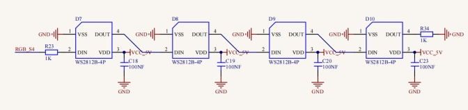

### Project 2 WS2812 RGB

**1.Description**


In this project, we will work to use WS2812 LED to display different colors. Its principle is different from the seven-color LED, we need a pin to control it. This is an intelligent external controlled LED light source integrating control circuit and light emitting circuit. The appearance of each LED is the same as that of a 5050 LED and each component is a pixel. There are four LEDs on our motor driver board, namely four pixels. Let's learn how to control it to display any color. 

**2.Component Knowledge**

、

The four pixel LEDs are connected in series, and we can control any one of the LEDs with a pin and make it display any color. The pixel contains an intelligent digital interface data locking signal and amplifying driver circuit as well as a high-precision internal oscillator and a 12V high voltage programmable constant current control part, which effectively ensures the color consistency of the pixel light.  

The data protocol adopts the communication mode of single-line return to zero code. After the pixel is powered on and reset, the S terminal receives the data transmitted from the controller. 

When the first 24bit data extracted by the first pixel, which will be sent to the data latch inside the pixel. This 2812RGB communication protocol and driver has been encapsulated in the bottom layer, we can directly call the interface function to use.  

**3.Test Code** 

```
from machine import Pin,I2C
import mecanumCar_v2
import time

#Create a class called mecanumCar for controlling the car
i2c = I2C(0, sda = Pin(20), scl = Pin(21), freq = 400000)
mecanumCar = mecanumCar_v2.Driver(i2c)

mecanumCar.pixels_set(0, (255, 0, 0))
mecanumCar.pixels_set(1, (0, 255, 0))
mecanumCar.pixels_set(2, (0, 0, 255))
mecanumCar.pixels_set(3, (255, 255, 255))
mecanumCar.pixels_show()
```

**4.Test Result**

First, make sure the library files are installed, otherwise the code will fail to compile. Here we use the library file rgb, please refer to the develop environment for installation. 

Clickto run the code, then we can see that the 4 LEDs will respectively be red, green, blue and white. 

**5.Code Explanation**

| import random                          | Import random module                                         |
| -------------------------------------- | ------------------------------------------------------------ |
| mecanumCar = mecanumCar_v2.Driver(i2c) | Create an instance to drive the car                          |
| mecanumCar.pixels_set(num, (r, g, b))  | Set the color of the LED. Num is the LED number and the four LED numbers are 0, 1, 2, and 3 respectively. r, g, and b are the colors of the LEDs. |
| mecanumCar.show();                     | Refresh display                                              |
| random.randint(0, 255)                 | Return the random number from 0 to 255                       |
| for i in range(4):                     | The variable i is added from 0 to 3 four times and every time add 1 |

**6.Expanded Project Flowing Water Light** 

```
Keyestudio 4WD Mecanum Robot for Pico
lesson 2.2
WS2812
http://www.keyestudio.com
'''
from machine import Pin,I2C
import mecanumCar_v2
import time
import random

#Create a class called mecanumCar for controlling the car
i2c = I2C(0, sda = Pin(20), scl = Pin(21), freq = 400000)
mecanumCar = mecanumCar_v2.Driver(i2c)


#Principal loop function
while True:
    r = random.randint(0, 255) #Take a random number from 0~255
    g = random.randint(0, 255)
    b = random.randint(0, 255)
    for i in range(4):
        mecanumCar.pixels_set(i, (r, g, b)) #The color of the i +1 LED is random(r,g,b)
        mecanumCar.pixels_show() #Refresh display
        time.sleep(0.1) #Wait for a while
```

Once the code has been uploaded successfully, we will see four LEDs showing the flowing light in a random color. 