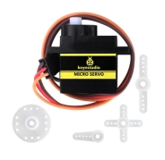
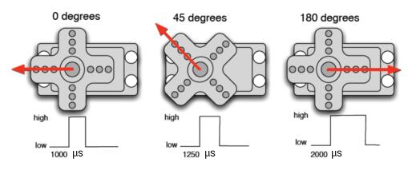

### Project 3 Servo

**1.Description**



For those DIY smart cars, they often have the function of automatic obstacle avoidance. In the DIY process, we need a servo to control the ultrasonic module to rotate left and right, and then detect the distance between the car and the obstacle, so as to control the car to avoid the obstacle. 

If other microcontrollers are used to control the rotation of the servo, we need to set a certain frequency and a certain width of pulse to control the servo angle. However, the frequency and pulse width have been adjusted in the library file, and the pins have been fixed in GPIO2. If necessary, we can change the pin number in the mecanumcar_v2.py file, and the rest we solely need to set the control angle in the develop environment. 

 In this project, you will learn how to control the servo to rotate back and forth between 0° and 180°.

**2.Component Knowledge**

Angle range：180°（There are 360°servo，180°servo，90°servo）

Driver voltage：3.3V or 5V

The pins are usually three wires




GND： This is a grounded pin, which is brown.

VCC:     This is a pin connected to +5v（3.3V）power, which is red.

S：       This is a pin controlled by PWM signal, which is orange.(Here we connect it to GPIO2

**3.Control Principle**

The rotation angle of servo is controlled by regulating the duty cycle of PWM (Pulse-Width Modulation) signal. The standard cycle of PWM signal is 20ms (50Hz). Theoretically, the width is distributed between 1ms-2ms, but in fact, it's between 0.5ms-2.5ms. The width corresponds to the rotation angle from 0° to 180°. But note that for different brand servo, the same signal may have different rotation angle. 

**4.Test Code**

```
from machine import Pin,I2C
import mecanumCar_v2
import time

i2c = I2C(0, sda = Pin(20), scl = Pin(21), freq = 400000)
#print("STC8G1K08 address：", machine.I2C.scan(i2c))
mecanumCar = mecanumCar_v2.Driver(i2c)

mecanumCar.set_angle(90) #Rotate to 90 degrees
time.sleep(1)

# Principal loop function
while True:
    for i in range(180):
        mecanumCar.set_angle(i) #Rotate from 0 to 180 degrees  
        time.sleep_ms(20) #Wait for a while
    for i in range(180):
        mecanumCar.set_angle(180-i) #Rotate from 180 to 0 degrees
        time.sleep_ms(20) #Wait for a while
```

**5.Test Result**

Turn on the switch after powering on, click  to run the code, then we will see that the servo will turn back and forth from 0 degrees to 180 degrees .

**6.Code Explanation** 

| for i in range(180):        | The variable i ranges from 0 to 180 (excluding 180), adding by 1 each time |
| --------------------------- | ------------------------------------------------------------ |
| mecanumCar.set_angle(angle) | Set servo to angle position.                                 |
| time.sleep_ms(20)           | Millisecond delay function                                   |
| mecanumCar.set_angle(180-i) | When i variable from 0 to 180, 180-i is equivalent to from 180 to 0, at this time we can set the servo rotates from 180 to 0 degrees |