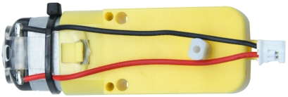
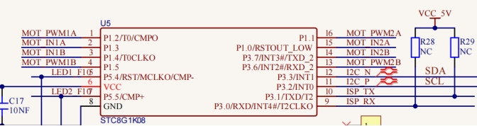

### Project 4 DC Reduction Motor

**1.Description**



The kit is equipped with 4 DC reduction motors, which are developed on the ordinary DC motors. It has a matching gear reduction box which provides a lower speed but a larger torque. Furthermore, different reduction ratios of the box can provide different speeds and torques.

The reduction motor is the integration of gearmotor and motor, which is applied widely in steel and machine industry.

The current of the motor driver is relatively large. If we use the IO port to force the motor to drive, either the motor will not rotate or the IO port will be burned, thereby it entails a motor driver chip. The DRV8833 motor driver chip has been included on the motor driver base board, which is used to control the rotation direction and speed of the 4 DC reduction motors. The circuit schematic diagram of the two chips are as below.

 **2.Component Knowledge**




Each chip controls 4 pins, and 2 pins control one motor.

**3.Test Code**

```
from machine import Pin,I2C
import mecanumCar_v2
import time

i2c = I2C(0, sda = Pin(20), scl = Pin(21), freq = 400000) #iic0 sda-->20,scl-->21
mecanumCar = mecanumCar_v2.Driver(i2c) #Create an instance for the car

# Principal loop function
while True:
  mecanumCar.Advance()
  time.sleep(2)           #Wait for 2 s
  
  mecanumCar.Back()       #Move back
  time.sleep(2)
  
  mecanumCar.Turn_Left(); #Turn left
  time.sleep(2)

  mecanumCar.Turn_Right() #Turn right
  time.sleep(2)

  mecanumCar.stop();      #Stop
  time.sleep(1)
```

**4.Test Result**

First, make sure the library files are installed, otherwise the code will fail to compile. Here we use the library file MecanumCar_v2, please refer to the develop environment for installation.

Turn on the switch and clickto run the code, then we can see that the car goes forward for 2s, goes back for 2s, turns left for 2s, turns right for 2s and then stops for 1s.

**5.Code Explanation**

| time.sleep(2)            | Wait for 2s                                                  |
| ------------------------ | ------------------------------------------------------------ |
| mecanumCar.Advance()     | 4 motors and the car go forward                              |
| mecanumCar.Back();       | 4 motors the car move back                                   |
| mecanumCar.Turn_Left();  | The left motors move back, the right motors turn forward and the car turns left |
| mecanumCar.Turn_Right(); | The left motors turn forward, the right motors move back and the car turns right |
| mecanumCar.stop();       | 4 motors and the car stop                                    |

