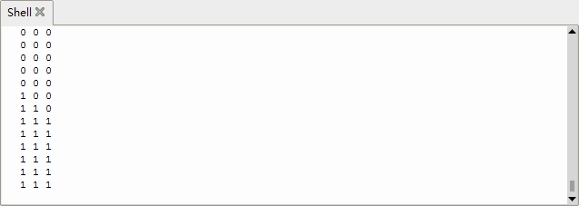

### Project 5 Line Tracking Sensor

**1.Description**


The line tracking sensor is actually an infrared sensor. There are 3-channel line tracking in front of the driver base board of the car, and the component used here is TCRT5000 IR tube. It works by using the different reflectance of IR light on colors and then converting the intensity of the reflected signal into an electric current signal. 

Black is active at high voltage, while white is active at low voltage when detecting. The detection height is 0-3 cm. There are three blue rotating potentiometers to adjust the detection sensitivity of the sensor.

**2.Component Knowledge**

- Working voltage: 3.3-5V (DC)
- Interface: 5PIN interface (connect to 16,17,18)
- Output signal: Digital
- Height detection: 0-3 cm

**Principle:** It works by using the different reflectance of IR ray on colors and then converting the intensity of the reflected signal into an electric current signal. When powering on, the diode emits IR light.  FB- is the potentiometer, adjusting it can get a threshold voltage for the 4, 6 and 8 pins of the voltage comparator LM393. The voltage value can be determined according to the actual situation. 

When infrared diode receives the infrared light, they will generate a current, and as the infrared light changes from weak to strong, the current increases from small to large. However, when there is no infrared light or it is very weak, the output signal is close to VCC.

After passing the LM393 comparator, the receiving detection pin outputs a high level. When the light intensity and the current increase, the output voltage will become smaller, when it is small to a certain extent, the pin will become low level.

Furthermore, if black or no object is detected, the signal end of the MCU will receive a high level. While a white object is detected, a low level will be received. 


**3.Test Code**

```
from machine import Pin
import time

l_pin = Pin(16, Pin.IN)
m_pin = Pin(17, Pin.IN)
r_pin = Pin(18, Pin.IN)

while True:
    l_val = l_pin.value() #Read the value of the left line tracking sensor
    m_val = m_pin.value() #Read the value of the middle line tracking sensor
    r_val = r_pin.value() #Read the value of the right line tracking sensor
    print(l_val, end = ' ')
    print(m_val, end = ' ')
    print(r_val)
    time.sleep_ms(100)
```

**4.Test Result**

urn on the switch to power on, click to run the code, then look at the Shell below, we can see the digital signal received by the three-channel line tracking sensor printed on the monitor. When we cover it with white paper, the output is 0, when using black paper or hanging the car, the output is 1.



**5.Code Explanation**

| l_pin = Pin(16, Pin.IN)<br>m_pin = Pin(17, Pin.IN)<br>r_pin = Pin(18, Pin.IN) | Pins interface definition of the three-channel line tracking sensor. The left is connected to GPIO16，middle is connected to GPIO17，right is connected to GPIO18.All pins are set to input mode. |
| ------------------------------------------------------------ | ------------------------------------------------------------ |
| l_pin.value()                                                | Read the digital level of the pin, when the pin is 3.3V, the value we read is 1, when the pin is 0V,  the value we read is 0, after reading we use a variable l_val to save them |
| print(l_val, end = ' ')                                      | Print the value of l_val read, end = ' ' indicates not newline |
| print(r_val)                                                 | Newline print the value of r_val                             |

