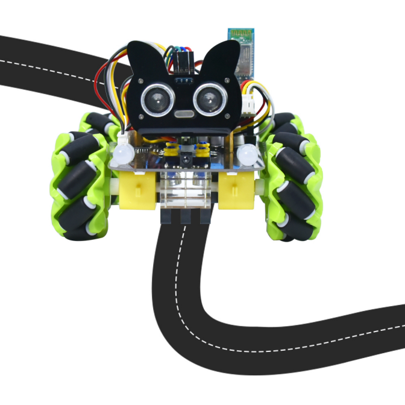
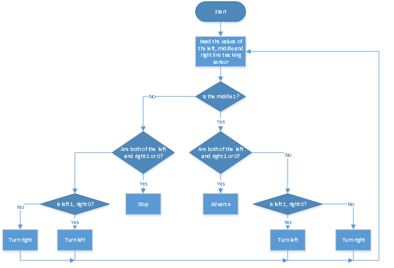

### Project 6 Line Tracking Smart Car



**1.Description**

In this project we will make a line tracking smart car. It works to use a line tracking sensor to detect the black track of the road, and the road surface detection signal is fed back to the control board. 

The control board analyzes and judges the collected signals, and timely controls the motor to adjust the direction of the car, making the car run automatically along the black track to realize the purpose of automatic tracking of the car.  

**2.Flow Diagram**



**3.Test Code**

```
from machine import Pin,I2C
import mecanumCar_v2
import time

i2c = I2C(0, sda = Pin(20), scl = Pin(21), freq = 400000)
#print("STC8G1K08 address：", machine.I2C.scan(i2c))
mecanumCar = mecanumCar_v2.Driver(i2c)

l_pin = Pin(16, Pin.IN)
m_pin = Pin(17, Pin.IN)
r_pin = Pin(18, Pin.IN)


while True:
    l_val = l_pin.value()
    m_val = m_pin.value()
    r_val = r_pin.value()
    if m_val == 1:
        if l_val == 1 and r_val == 0:
            mecanumCar.Turn_Left()
        elif l_val == 0 and r_val == 1:
            mecanumCar.Turn_Right()
        else:
            mecanumCar.Advance()
    else:
        if l_val == 1 and r_val == 0:
            mecanumCar.Turn_Left()
        elif l_val == 0 and r_val == 1:
            mecanumCar.Turn_Right()
        else:
            mecanumCar.stop()
```

**4.Test Result**

After powering on, clickto run the code, put the car on the black tracking chart and the car will drive along the black line.

**5.Code Explanation**

| if m_val==1                     | If m_val is 1，then the middle sensor detects black line.    |
| ------------------------------- | ------------------------------------------------------------ |
| ifl_val == 1 and r_val == 0:    | If l_val is 1and r_val is 0，then the left sensor detects black line and right detects white. |
| elif l_val == 0 and r_val == 1: | If l_val is 0 and r_valis1，then the left sensor detects white line and right detects black. |

