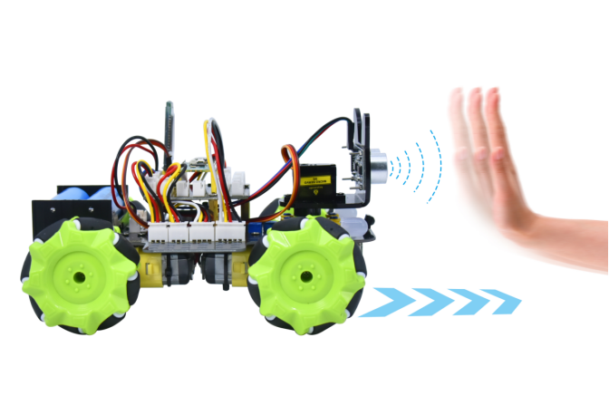

### Project 8 Ultrasonic Following Smart Car



**1.Description**

In this project, we will work to combine an ultrasonic sensor with motors to make an automatic follow smart car.

The ultrasonic sensor detects the smart car and the obstacle distance to control the motion status of car.

**2.Flow Diagram**


**3.Test Code**

```
from machine import Pin,I2C
import mecanumCar_v2
import time

i2c = I2C(0, sda = Pin(20), scl = Pin(21), freq = 400000) #iic0 sda-->20,scl-->21
mecanumCar = mecanumCar_v2.Driver(i2c) #Create an instance for the car

while True:
    distance = mecanumCar.get_distance()
    if distance <= 15:
        mecanumCar.Back()
    elif distance <= 25:
        mecanumCar.stop()
    elif distance <= 45:
        mecanumCar.Advance()
    else:
        mecanumCar.stop()
```

**4.Test Result**

After uploading the code successfully, turn on the switch and the car will follow in a straight line. We put the palm of our hand in front of the ultrasonic, slowly forward, the car will follow our palm to move.

**5.Code Explanation**

| distance = mecanumCar.get_distance()             | Define an integer variable to store the measured distance, and then control the car driving according to it |
| ------------------------------------------------ | ------------------------------------------------------------ |
| if distance <= 15:<br>      mecanumCar.Back();   | When the front distance measured is less than 15cm, the car moves back |
| elif distance <= 25:<br>     mecanumCar.Stop();  | Otherwise, the car will stop when the front distance is less than 25cm |
| elif distance <= 45:<br/>     mecanumCar.Stop(); | The car will go forward when the front distance is less than 45cm |
| else:<br/>     mecanumCar.Stop();                | The car will stop when the front distance is bigger than 45cm |

