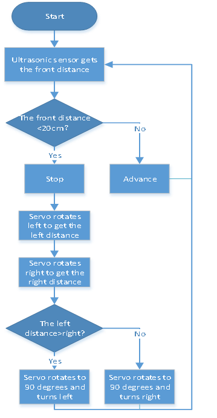

### Project 9 Ultrasonic Avoidance Smart Car


**1.Description**

Ultrasonic avoidance smart car is used to control the car motion state, so as to achieve obstacle avoidance by using the ultrasonic sensor detecting the obstacles distance. 

**2.Flow Diagram**



**3.Test Code**

```
from machine import Pin,I2C
import mecanumCar_v2
import time

i2c = I2C(0, sda = Pin(20), scl = Pin(21), freq = 400000) #iic0 sda-->20,scl-->21
mecanumCar = mecanumCar_v2.Driver(i2c) #Create a driver instance for the car

mecanumCar.set_angle(90)
time.sleep(0.5)
while True:
    distance = mecanumCar.get_distance()
    if distance <= 15:
        mecanumCar.stop()
        time.sleep(0.5)
        mecanumCar.set_angle(180)
        time.sleep(0.5)
        l_distance = mecanumCar.get_distance()
        time.sleep(0.1)
        mecanumCar.set_angle(0)
        time.sleep(0.5)
        r_distance = mecanumCar.get_distance()
        time.sleep(0.1)
        mecanumCar.set_angle(90)
        time.sleep(0.5)
        if l_distance > r_distance:
            mecanumCar.Turn_Left()
             time.sleep(0.3)
        else:
            mecanumCar.Turn_Right()
            time.sleep(0.3)
    else:
        mecanumCar.Advance()
```

**4.Test Result**

After clickingto run the code successfully and power up, then the car can automatically avoid obstacles. Note that the speed can’t be too large. 

The car will stop when encountering obstacles in front of it and the servo cradle head will rotate left to detect the left distance, then rotate right to detect the right distance. Then judge the distance between the obstacles on the left and the right, the car will turn along the farther side, and then continue to drive. 

**5.Code Explanation**

| mecanumCar.set_angle(90)                                     | Make the servo rotate to 90 degrees                          |
| ------------------------------------------------------------ | ------------------------------------------------------------ |
| distance = mecanumCar.get_distance()                         | Define an variable distance to store the measured distance, and then control the car driving according to it |
| if distance <= 15:                                           | If the distance is less than 15cm, the car will stop and judge the left and right distance |
| mecanumCar.set_angle(180)<br>time.sleep(0.5)<br>l_distance = mecanumCar.get_distance()<br>time.sleep(0.1) | Ultrasonic turns right to detect and save the distance       |
| mecanumCar.set_angle(0)<br/>time.sleep(0.5)<br/>l_distance = mecanumCar.get_distance()<br>time.sleep(0.1) | Ultrasonic turns right to detect and save the distance       |
| mecanumCar.set_angle(90)<br>time.sleep(0.5)                  | The servo return to the 90 degrees position                  |
| if l_distance > r_distance                                   | Judge the left and right distance                            |
| mecanumCar.Advance()                                         | If the front distance is bigger than 15cm, the car will advance |

